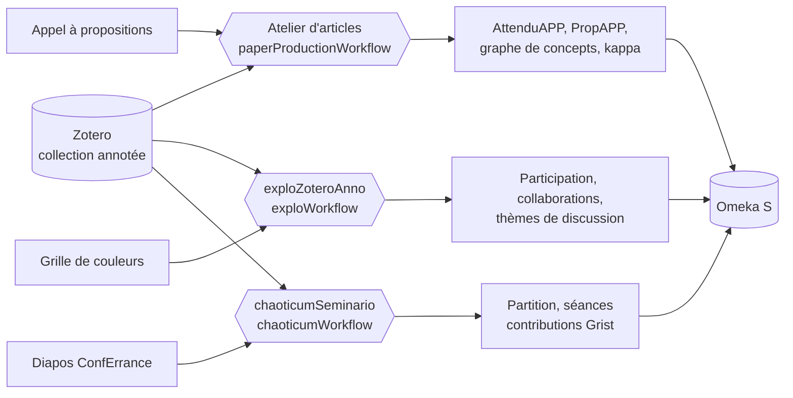

# ecosysteme-agents-recherche

Écosystème d'agents IA pour la production d'articles scientifiques (Laboratoire Paragraphe, Université Paris 8).

Trois applications, chacune avec son workflow d'agents et son serveur, partagent les mêmes sources (**Zotero**), les mêmes modèles (**API Albert**) et la même archive (**Omeka S**) :

| Application | Workflow | Adresse | Pour |
|---|---|---|---|
| **Atelier d'articles** | `paperProductionWorkflow` | http://127.0.0.1:7272 | répondre à un appel à propositions à partir d'une collection annotée |
| **exploZoteroAnno** | `exploWorkflow` | http://127.0.0.1:7273 | animer l'annotation collective d'une collection |
| **chaoticumSeminario** | `chaoticumWorkflow` | http://127.0.0.1:7276 | générer et jouer la partition d'une conférence participative |

À partir d'une **collection Zotero annotée** et d'un **appel à propositions**, l'**Atelier d'articles** :

- analyse les **attendus de l'appel** (AttenduAPP) ;
- extrait le texte, les annotations, les notes et les images des documents, et construit un **graphe de concepts** ;
- mesure l'**accord inter-juges** (kappa de Fleiss et de Cohen) sur une grille de positionnements argumentatifs ;
- rédige une **proposition d'article** (PropAPP) selon un plan paramétrable, avec références BibTeX, citations et mots-clés ;
- archive l'ensemble dans **Omeka S**.

**exploZoteroAnno** accompagne un groupe qui annote ensemble une collection Zotero :

- fixe une **grille de couleurs** commune et produit le **guide d'annotation** à partager ;
- mesure la **participation** de chaque collaborateur (surlignages, notes, documents, chronologie) ;
- analyse les **collaborations** : passages communs, convergences et divergences de lecture, kappa, réseau ;
- propose des **thèmes de discussion** pour une séance collective ;
- indexe la collection dans le **RAG d'Albert** (une collection privée Albert par collection Zotero) pour l'**interroger** avec des modèles de prompt enregistrés dans Omeka S, avec le coût de chaque consultation ;
- fusionne les **documents en double** de la collection et archive le tout dans **Omeka S**.

**chaoticumSeminario** génère la **partition d'une conférence** : une suite d'écrans calculée pour un nombre d'écrans et une durée donnés, à partir de **citations** tirées de Zotero, de **diapos** tirées au hasard du site [ConfErrance](https://samszo.github.io/ConfErrance/), de **questions** et de **diagrammes** produits par Albert (vision et analyse), et des **URL proposées par le public** via un formulaire Grist (QR code). Un lecteur plein écran déroule la partition avec un **chronomètre** (vert, orange, rouge) et une navigation complète ; chaque **séance** est enregistrée dans Omeka S et peut être **rejouée**.



## Démarrage rapide

**Avec Docker**

```bash
mkdir -p data && cp .env.example data/.env   # renseigner les clés
docker compose up -d --build
```

**En local** (Node.js 22+)

```bash
npm ci
cp .env.example .env                         # renseigner les clés
npm run ui          # Atelier d'articles : http://127.0.0.1:7272
npm run ui:explo    # exploZoteroAnno : http://127.0.0.1:7273
npm run ui:chaoticum  # chaoticumSeminario : http://127.0.0.1:7276 (après npx playwright install chromium)
```

Les connexions (Albert, Zotero, Omeka S) se règlent sur la page **⚙ Paramètres** de chaque application (`/parametres`). Puis ouvrir l'Atelier d'articles (http://127.0.0.1:7272 : tester les connexions, choisir la collection Zotero et l'appel à propositions, lancer le traitement) ou exploZoteroAnno (http://127.0.0.1:7273 : choisir la collection, ajuster la grille, partager le guide, analyser). Les deux applications peuvent traiter en même temps.

En ligne de commande, avec la configuration enregistrée : `npm start` (Atelier d'articles) et `npm run explo` (exploZoteroAnno).

## Documentation

| | |
|---|---|
| [Installation](docs/installation.md) | prérequis, installation locale, débogage et Docker (deux serveurs), préparation d'Omeka S et de Zotero, dépannage |
| [Utilisateur](docs/utilisateur.md) | préparer le corpus, utiliser l'Atelier d'articles et exploZoteroAnno, lire les résultats |
| [Technique](docs/technique.md) | architecture, les deux workflows, modules, modèle de données, configuration, API |

Version HTML : `npm run docs` puis `docs/html/index.html`, ou `/docs/` sur l'un des serveurs (http://127.0.0.1:7272/docs/, http://127.0.0.1:7273/docs/).

# TODO
on continue le développement  de l'écosystème d'agents pour le recherche avec un nouveau worflow : recocita.
- reprendre des autres workflow :
    - les principes de connexions  à : albert, zotero, omeka
    - l'analyse des coûts du workflow
    - la sauvegarde dans Omeka 
- ajouter la connexion à l'API isidore : https://isidore.science/api
    - paramètrer le choix de la discipline : https://aurehal.archives-ouvertes.fr/domain/index
    - paramétrer l'interval de date de la recherche
- choisir la collection Zotero contenant le document à analyser
- le document à analyser est signaler par la présence du mot clef : recocita
   - transformer le document en markdown
   - enregistrer le document dans omeka 
- analyser les annotations du document suivant le code couleur :
   - vert = suggérer des références pour le passage surligné 
   - jaune = ajouter des références du même auteur en lien avec les sujets
   - rouge = vérifier les références de la citation
- pour chaque surlignage faire le traitement appropié à chaque couleur
   - vert : 
      - rechercher des références dans la bibliothèque zotero de l'utilisateur en privilégiant les notes "citation"
      - recherche des références dans isidore correspondant à l'annotation
   - jaune :
      - rechercher des références dans la bibliothèque zotero de l'utilisateur l'auteur surligné
      - recherche des références dans isidore correspondant à l'auteur surligné
   - rouge : vérifier si la référence soulignée existe
- pour chaque références trouvées en lien avec une annotation verte ou jaune permettre de :
   - accepter la référence :
      - enregistrer la référence dans la collection zotero
      - ajouter le code bibtex de citation dans le document markdown
      - ajouter la référence bibtex dans un fichier "identifiant de la collection zotero".bib
   - explorer la référence :
      - analyser le document lié à la référence pour suggérer des passages pouvant être cité
      - afficher les passages suggérer
      - pour chaque passage permettre de :
        - accepter le passage :
           - accepter la référence
           - copier le passage dans le document markdown
        - refuser le passage
   - refuser la référence     
   - les choix sont enregistrés pour consolider le prompt d'analyse

