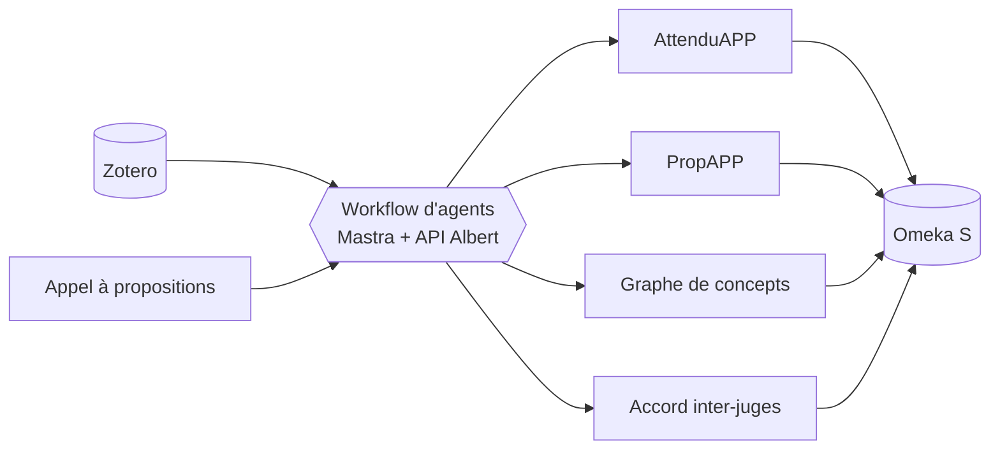

# ecosysteme-agents-recherche

Écosystème d'agents IA pour la production d'articles scientifiques (Laboratoire Paragraphe, Université Paris 8).

À partir d'une **collection Zotero annotée** et d'un **appel à propositions**, un workflow d'agents :

- analyse les **attendus de l'appel** (AttenduAPP) ;
- extrait le texte, les annotations, les notes et les images des documents, et construit un **graphe de concepts** ;
- mesure l'**accord inter-juges** (kappa de Fleiss et de Cohen) sur une grille de positionnements argumentatifs ;
- rédige une **proposition d'article** (PropAPP) selon un plan paramétrable, avec références BibTeX, citations et mots-clés ;
- archive l'ensemble dans **Omeka S**.



## Démarrage rapide

**Avec Docker**

```bash
mkdir -p data && cp .env.example data/.env   # renseigner les clés
docker compose up -d --build
```

**En local** (Node.js 22+)

```bash
npm ci
cp .env.example .env                         # renseigner les clés
npm run ui
```

Puis ouvrir http://127.0.0.1:7272, tester les connexions, choisir la collection Zotero et l'appel à propositions, et lancer le traitement.

## Documentation

| | |
|---|---|
| [Installation](docs/installation.md) | prérequis, installation locale et Docker, préparation d'Omeka S et de Zotero, dépannage |
| [Utilisateur](docs/utilisateur.md) | préparer le corpus, utiliser l'interface, lire les résultats |
| [Technique](docs/technique.md) | architecture, workflow, modules, modèle de données, configuration, API |

Version HTML : `npm run docs` puis `docs/html/index.html`, ou http://127.0.0.1:7272/docs/ depuis l'interface.
