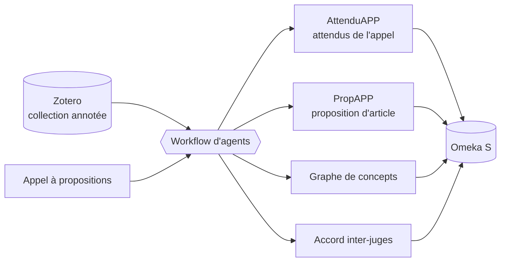

# Documentation

Écosystème d'agents IA pour la production d'articles scientifiques : à partir d'une **collection Zotero** annotée et d'un **appel à propositions**, le workflow analyse les attendus de l'appel, construit un graphe de concepts, mesure l'accord entre annotateurs et rédige une **proposition d'article**, le tout archivé dans **Omeka S**.

| Document | Pour qui | Contenu |
|---|---|---|
| [Installation](installation.md) | administrateur | prérequis, installation locale et Docker, préparation d'Omeka S et de Zotero, dépannage |
| [Utilisateur](utilisateur.md) | chercheur, annotateur | préparer le corpus, utiliser l'interface, lire les résultats |
| [Technique](technique.md) | développeur | architecture, workflow, modules, modèle de données, configuration, API |

La version HTML de cette documentation est générée par `npm run docs` dans `docs/html/` ; elle est aussi servie par l'interface sur http://127.0.0.1:7272/docs/.
