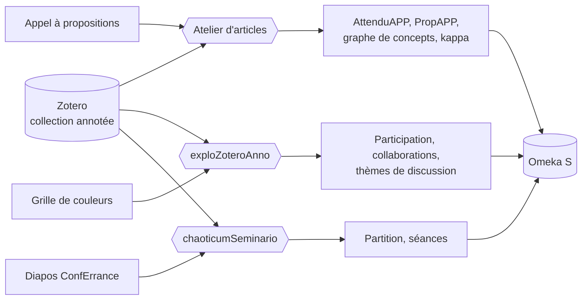

# Documentation

Écosystème d'agents IA pour la recherche (Laboratoire Paragraphe, Université Paris 8). Trois applications, chacune avec son workflow et son serveur, partagent les mêmes sources (**Zotero**), les mêmes modèles (**API Albert**) et la même archive (**Omeka S**) :

| Application | Adresse | Rôle |
|---|---|---|
| **Atelier d'articles** | http://127.0.0.1:7272 | à partir d'une collection annotée et d'un **appel à propositions** : attendus de l'appel, graphe de concepts, accord entre annotateurs, **proposition d'article** |
| **chaoticumSeminario** | http://127.0.0.1:7276 | **partition d'une conférence participative** : citations Zotero, diapos ConfErrance, questions et diagrammes générés, contributions du public (Grist), lecteur avec chronomètre, séances enregistrées et rejouables |
| **exploZoteroAnno** | http://127.0.0.1:7273 | **annotation collective** d'une collection : grille de couleurs et guide, participation, collaborations, thèmes de discussion |

| Document | Pour qui | Contenu |
|---|---|---|
| [Installation](installation.md) | administrateur | prérequis, installation locale, débogage et Docker (deux serveurs), préparation d'Omeka S et de Zotero, dépannage |
| [Utilisateur](utilisateur.md) | chercheur, annotateur, animateur de groupe | préparer le corpus, utiliser l'Atelier d'articles et exploZoteroAnno, lire les résultats |
| [Technique](technique.md) | développeur | architecture, les deux workflows, modules, modèle de données, configuration, API |

La version HTML de cette documentation est générée par `npm run docs` dans `docs/html/` ; elle est aussi servie par chacun des serveurs sur `/docs/` (http://127.0.0.1:7272/docs/, http://127.0.0.1:7273/docs/).
