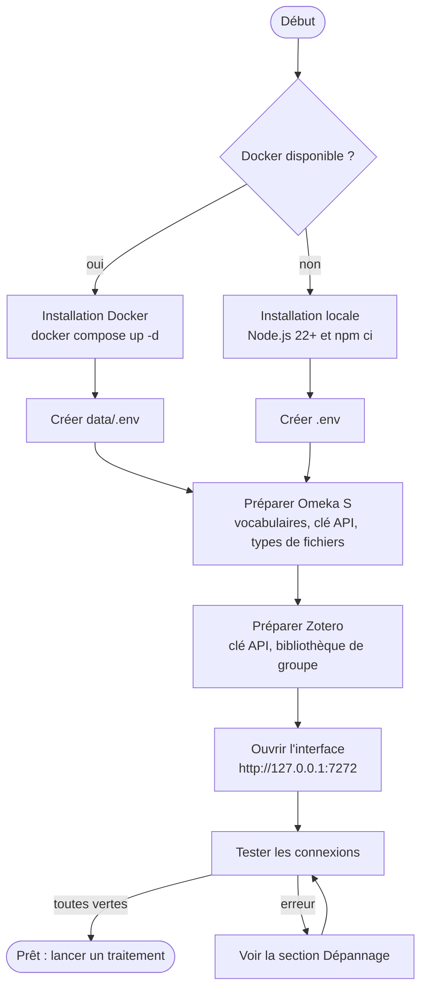
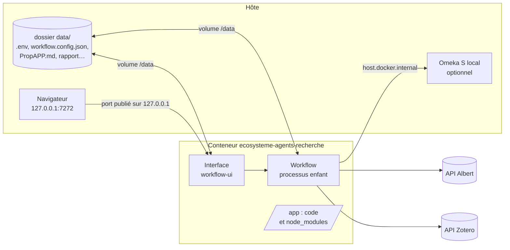
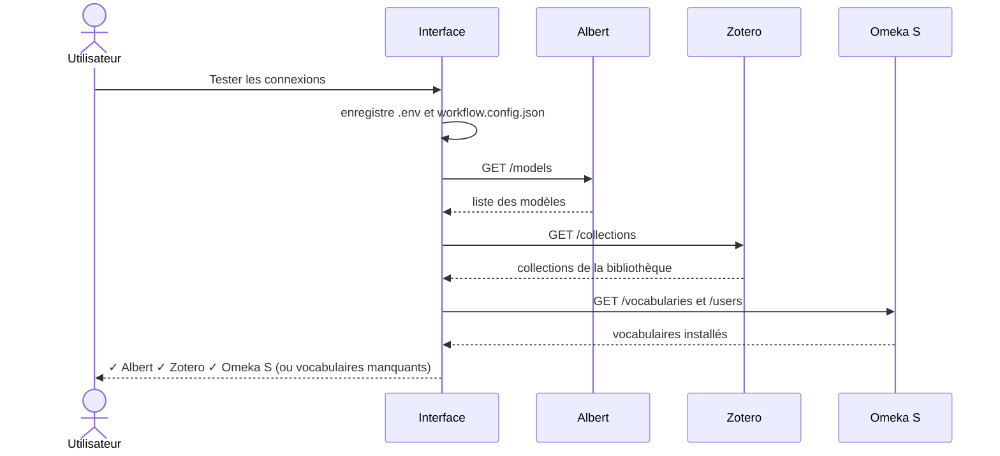

# Documentation d'installation

Ce guide explique comment installer l'écosystème d'agents de production d'articles scientifiques, soit **en local avec Node.js**, soit **dans un conteneur Docker**, puis comment préparer les trois services dont il dépend : l'API **Albert**, **Zotero** et **Omeka S**.



## 1. Prérequis

| Élément | Version / détail |
|---|---|
| Node.js | 22 ou plus récent (installation locale) |
| npm | fourni avec Node.js |
| Docker | Docker Engine 24+ et Docker Compose v2 (installation Docker) |
| API Albert | une clé d'API (Etalab) donnant accès aux modèles `openai/gpt-oss-120b` et `mistralai/Ministral-3-8B-Instruct-2512` (modifiables) |
| Zotero | un compte, une clé d'API en lecture, idéalement une **bibliothèque de groupe** pour les annotations de plusieurs juges |
| Omeka S | une instance accessible, une clé d'API avec droits d'écriture, les vocabulaires listés plus bas |
| Accès internet | pour les API, et pour les bibliothèques d'affichage (marked, sigma.js, Mermaid) chargées depuis jsDelivr |

## 2. Variables d'environnement (`.env`)

Le fichier `.env` contient les accès aux services. Un modèle est fourni dans `.env.example`. Toutes ces valeurs sont aussi modifiables depuis l'onglet **Paramètres** de l'interface.

| Variable | Obligatoire | Description |
|---|---|---|
| `ALBERT_API_KEY` | oui | Clé de l'API Albert |
| `ZOTERO_API_KEY` | oui | Clé Zotero (https://www.zotero.org/settings/keys), accès en lecture à la bibliothèque |
| `ZOTERO_USER_ID` | oui | Identifiant numérique de l'utilisateur Zotero (affiché sur la page des clés) |
| `ZOTERO_GROUP_ID` | non | Identifiant du groupe Zotero ; s'il est défini, c'est la bibliothèque du groupe qui est lue |
| `OMKS_API_URL` | oui | URL de l'API Omeka S, par ex. `https://mon-omeka.fr/api` |
| `OMKS_KEY_IDENTITY` | oui | Identité de la clé d'API Omeka S |
| `OMKS_KEY_CREDENTIAL` | oui | Secret de la clé d'API Omeka S |
| `PORT` | non | Port de l'interface (7272 par défaut) |

> Le fichier `.env` contient des secrets : il est exclu de git (`.gitignore`) et de l'image Docker (`.dockerignore`).

## 3. Installation locale (Node.js)

```bash
git clone https://github.com/samszo/ecosysteme-agents-recherche.git
cd ecosysteme-agents-recherche
npm ci
cp .env.example .env    # puis renseigner les valeurs
npm run ui              # interface : http://127.0.0.1:7272
```

Commandes disponibles :

| Commande | Rôle |
|---|---|
| `npm run ui` | Interface web : paramètres, lancement, suivi, résultats |
| `npm start` | Lance le workflow en ligne de commande avec la configuration enregistrée |
| `npm run docs` | Régénère la documentation HTML (`docs/html/`) à partir des fichiers markdown |

En local, les fichiers produits (AttenduAPP, PropAPP, rapport, graphe…) sont écrits à la racine du projet.

## 4. Installation Docker

L'image contient le code dans `/app` ; les **données** (`.env`, `workflow.config.json`, résultats, fichiers d'appels importés) sont dans le volume `/data`, monté depuis le dossier `data/` du projet.



```bash
mkdir -p data
cp .env.example data/.env      # puis renseigner les valeurs
docker compose up -d --build   # construit l'image et démarre l'interface
docker compose logs -f         # suivre le démarrage
```

L'interface est disponible sur http://127.0.0.1:7272 (le port n'est publié que sur la machine hôte).

Autres commandes utiles :

```bash
docker compose exec workflow workflow        # lancer le workflow en ligne de commande dans le conteneur
docker compose restart workflow              # redémarrer après une modification du .env
docker compose down                          # arrêter
docker compose build --no-cache              # reconstruire après une mise à jour du code
```

**Omeka S installé sur la machine hôte** : dans le conteneur, `localhost` désigne le conteneur lui-même. Utiliser `host.docker.internal` dans `OMKS_API_URL`, par exemple `http://host.docker.internal/omk_agents/api` (le nom est déclaré dans `docker-compose.yml`).

## 5. Préparer Omeka S

### Vocabulaires

Le workflow utilise les vocabulaires suivants (réglage `omeka.vocabs`). L'onglet **Paramètres › Tester les connexions** signale ceux qui manquent.

| Préfixe | Usage | Installation |
|---|---|---|
| `dcterms` | métadonnées de tous les items | fourni avec Omeka S |
| `bibo` | classes des documents, BibTeX (DOI, ISSN…) | fourni avec Omeka S |
| `skos` | classe `skos:Concept` des concepts | import (Admin › Vocabulaires) |
| `oa` | classe `oa:Annotation` des annotations | module **Annotate** ou import de `http://www.w3.org/ns/oa#` |
| `curation` | `curation:access`, `curation:tag`, `curation:category`, `curation:type`… | module **Curation** (Daniel Berthereau) |

La classe de l'appel à propositions, `bibo:CallForPapers`, ne fait pas partie de BIBO : si elle est absente, l'appel est enregistré en `bibo:Document` (réglage `omeka.cfpClass`).

### Clé d'API

Dans Omeka S : *Utilisateur › Modifier › Clés d'API › Nouvelle clé*. L'utilisateur doit pouvoir créer et modifier des items et des médias. Reporter l'identité et le secret dans `OMKS_KEY_IDENTITY` et `OMKS_KEY_CREDENTIAL`.

### Types de fichiers autorisés

Le workflow dépose des médias de plusieurs formats. Dans *Admin › Paramètres › Sécurité*, ajouter si besoin :

| Extension | Type MIME | Fichiers concernés |
|---|---|---|
| `md` | `text/markdown`, `text/plain` | AttenduAPP, PropAPP, rapport, relecture |
| `bib` | `application/x-bibtex`, `text/plain` | références BibTeX |
| `csv` | `text/csv`, `text/plain` | désaccords entre juges |
| `html` | `text/html` | graphe sigma.js, pages web enregistrées |
| `json` | `application/json` | graphe au format graphology |

Un type refusé n'interrompt pas le traitement : un avertissement est affiché et le fichier reste disponible localement.

## 6. Préparer Zotero

1. Créer une clé sur https://www.zotero.org/settings/keys avec l'accès en lecture à la bibliothèque (et au groupe).
2. Pour mesurer l'accord inter-juges, utiliser une **bibliothèque de groupe** : chaque annotation y garde son auteur. Renseigner alors `ZOTERO_GROUP_ID`.
3. Choisir la collection à traiter dans l'interface (la liste est chargée depuis Zotero).

## 7. Vérifier l'installation

1. Ouvrir http://127.0.0.1:7272.
2. Onglet **Paramètres › Tester les connexions** : Albert, Zotero et Omeka S doivent apparaître en vert.
3. Choisir la collection Zotero et l'appel à propositions, puis **Enregistrer et lancer**.



## 8. Dépannage

| Symptôme | Cause probable | Solution |
|---|---|---|
| `Téléchargement de l'appel impossible (403)` | le site de l'appel est protégé contre les robots (Cloudflare) | enregistrer la page depuis un navigateur (PDF ou HTML) et l'importer comme **fichier de l'appel** |
| `vocabulaire(s) manquant(s)` au test des connexions | vocabulaire non installé dans Omeka S | voir *Préparer Omeka S › Vocabulaires* |
| `Échec de l'upload du media` | type de fichier refusé par Omeka S | voir *Types de fichiers autorisés* |
| Omeka S injoignable depuis Docker | `localhost` dans `OMKS_API_URL` | utiliser `host.docker.internal` |
| `EADDRINUSE` au lancement de l'interface | port déjà utilisé | changer `PORT` dans `.env` |
| Aucune annotation codée pour le kappa | codes absents ou bibliothèque personnelle | ajouter les codes de la grille comme marqueurs, utiliser une bibliothèque de groupe |
