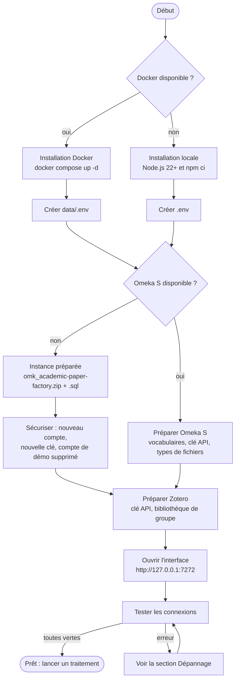
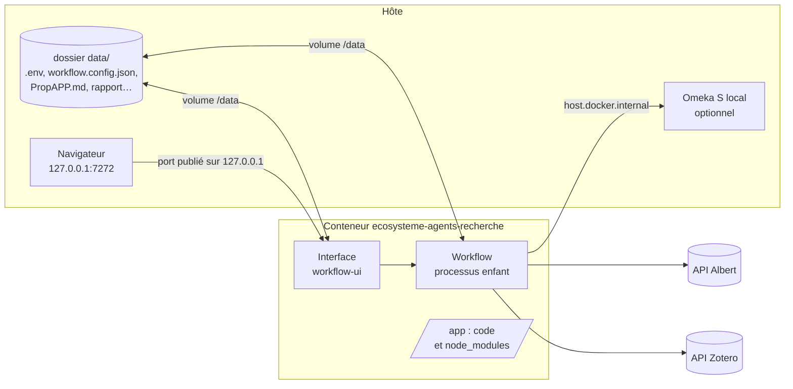
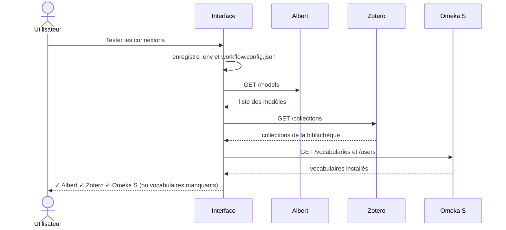
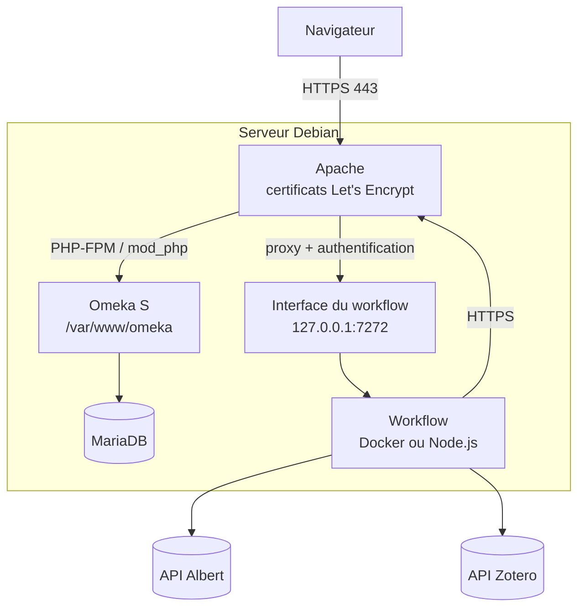

# Documentation d'installation

Ce guide explique comment installer l'écosystème d'agents de production d'articles scientifiques, soit **en local avec Node.js**, soit **dans un conteneur Docker**, puis comment préparer les trois services dont il dépend : l'API **Albert**, **Zotero** et **Omeka S**. Pour débuter rapidement, une **instance Omeka S préparée** (application et base de données) est fournie, et la section 8 décrit l'installation complète sur un **serveur Debian / Apache / Let's Encrypt**.



## 1. Prérequis

| Élément | Version / détail |
|---|---|
| Node.js | 22 ou plus récent (installation locale) |
| npm | fourni avec Node.js |
| Docker | Docker Engine 24+ et Docker Compose v2 (installation Docker) |
| API Albert | une clé d'API (Etalab) donnant accès aux modèles `openai/gpt-oss-120b` et `mistralai/Ministral-3-8B-Instruct-2512` (modifiables) |
| Zotero | un compte, une clé d'API en lecture, idéalement une **bibliothèque de groupe** pour les annotations de plusieurs juges |
| Omeka S | une instance accessible, une clé d'API avec droits d'écriture, les vocabulaires listés plus bas |
| Accès internet | pour les API, et pour les bibliothèques d'affichage (marked, sigma.js, Mermaid) chargées depuis jsDelivr |

## 2. Variables d'environnement (`.env`)

Le fichier `.env` contient les accès aux services. Un modèle est fourni dans `.env.example`. Toutes ces valeurs sont aussi modifiables depuis l'onglet **Paramètres** de l'interface.

| Variable | Obligatoire | Description |
|---|---|---|
| `ALBERT_API_KEY` | oui | Clé de l'API Albert |
| `ZOTERO_API_KEY` | oui | Clé Zotero (https://www.zotero.org/settings/keys), accès en lecture à la bibliothèque |
| `ZOTERO_USER_ID` | oui | Identifiant numérique de l'utilisateur Zotero (affiché sur la page des clés) |
| `ZOTERO_GROUP_ID` | non | Identifiant du groupe Zotero ; s'il est défini, c'est la bibliothèque du groupe qui est lue |
| `OMKS_API_URL` | oui | URL de l'API Omeka S, par ex. `https://mon-omeka.fr/api` |
| `OMKS_KEY_IDENTITY` | oui | Identité de la clé d'API Omeka S |
| `OMKS_KEY_CREDENTIAL` | oui | Secret de la clé d'API Omeka S |
| `PORT` | non | Port de l'interface (7272 par défaut) |

> Le fichier `.env` contient des secrets : il est exclu de git (`.gitignore`) et de l'image Docker (`.dockerignore`).

## 3. Installation locale (Node.js)

```bash
git clone https://github.com/samszo/ecosysteme-agents-recherche.git
cd ecosysteme-agents-recherche
npm ci
cp .env.example .env    # puis renseigner les valeurs
npm run ui              # interface : http://127.0.0.1:7272
```

Commandes disponibles :

| Commande | Rôle |
|---|---|
| `npm run ui` | Interface web : paramètres, lancement, suivi, résultats |
| `npm start` | Lance le workflow en ligne de commande avec la configuration enregistrée |
| `npm run docs` | Régénère la documentation HTML (`docs/html/`) à partir des fichiers markdown |

En local, les fichiers produits (AttenduAPP, PropAPP, rapport, graphe…) sont écrits à la racine du projet.

## 4. Installation Docker

L'image contient le code dans `/app` ; les **données** (`.env`, `workflow.config.json`, résultats, fichiers d'appels importés) sont dans le volume `/data`, monté depuis le dossier `data/` du projet.



```bash
mkdir -p data
cp .env.example data/.env      # puis renseigner les valeurs
docker compose up -d --build   # construit l'image et démarre l'interface
docker compose logs -f         # suivre le démarrage
```

L'interface est disponible sur http://127.0.0.1:7272 (le port n'est publié que sur la machine hôte).

Le conteneur démarre en root le temps de vérifier le volume : si le dossier `data/` ou ses fichiers n'appartiennent pas à l'utilisateur `node` du conteneur (uid 1000), c'est le cas quand ils ont été créés par root sur un serveur Linux, leur propriétaire est rétabli (`🔧 Droits du volume /data attribués à l'utilisateur node` dans le journal). L'interface et le workflow s'exécutent ensuite sans les droits root. Sur l'hôte, `data/` appartient donc à l'uid 1000 : l'éditer avec `sudo` ou avec l'utilisateur d'uid 1000.

Autres commandes utiles :

```bash
docker compose exec workflow workflow        # lancer le workflow en ligne de commande dans le conteneur
docker compose restart workflow              # redémarrer après une modification du .env
docker compose down                          # arrêter
docker compose build --no-cache              # reconstruire après une mise à jour du code
```

**Omeka S installé sur la machine hôte** : dans le conteneur, `localhost` désigne le conteneur lui-même. Le même `.env` peut pourtant servir en local et dans Docker : dans le conteneur (`RUNNING_IN_DOCKER=1`), une URL `http://localhost/…` ou `http://127.0.0.1/…` est automatiquement redirigée vers `host.docker.internal` (déclaré dans `docker-compose.yml`) pour les requêtes, tandis que les liens affichés (rapport, graphe) gardent l'URL d'origine, ouvrable depuis le navigateur de l'hôte.

## 5. Préparer Omeka S

### Démarrer avec l'instance Omeka S préparée

Deux fichiers permettent de démarrer avec une instance Omeka S déjà configurée pour le workflow :

| Fichier | Contenu |
|---|---|
| `omk_academic-paper-factory.zip` | application **Omeka S 4.2.1** avec les modules Annotate, Common, CustomVocab, EasyAdmin et Log |
| `omk_academic-paper-factory.sql` | base de données (MariaDB / MySQL, utf8mb4) : vocabulaires `dcterms`, `dctype`, `bibo`, `foaf`, `jdc`, `skos`, `curation`, `oa`, `rdf` ; types de fichiers autorisés (`md`, `csv`, `bib`, `html`, `json`, `txt`…) ; aucun contenu, aucune session ni journal |

La base contient un **compte d'administration de démarrage**, à supprimer après la première connexion :

| | |
|---|---|
| Identifiant | `admin@academic-article-factory.ai` |
| Mot de passe | `MotDePasseAChanger` |
| Clé d'API – identité (`OMKS_KEY_IDENTITY`) | `KKdoJi6f8SZUncBjK1YEZr32QTP5W0BF` |
| Clé d'API – secret (`OMKS_KEY_CREDENTIAL`) | `eibRXdDZkY7O5YkIvkAjHmmgT3GSlMKt` |

> ⚠️ **Ces identifiants sont publics** (ils figurent dans cette documentation). Une instance accessible depuis internet qui les conserve est ouverte à tous en écriture. Les étapes de sécurisation ci-dessous sont **obligatoires**, avant toute mise en ligne.

```mermaid
flowchart LR
    A[Créer la base<br/>et son utilisateur] --> B[Importer<br/>omk_academic-paper-factory.sql]
    B --> C[Décompresser<br/>omk_academic-paper-factory.zip]
    C --> D[Renseigner<br/>config/database.ini]
    D --> E[Connexion avec<br/>le compte de démarrage]
    E --> F[Créer son compte<br/>administrateur global]
    F --> G[Se reconnecter,<br/>créer sa clé d'API]
    G --> H[Supprimer le compte<br/>de démarrage et sa clé]
    H --> I[Reporter la nouvelle clé<br/>dans .env]
```



**1. Base de données** (adapter le nom, l'utilisateur et le mot de passe) :

```bash
sudo mysql -e "CREATE DATABASE omeka CHARACTER SET utf8mb4 COLLATE utf8mb4_unicode_ci;
CREATE USER 'omeka'@'localhost' IDENTIFIED BY 'un-mot-de-passe-solide';
GRANT ALL PRIVILEGES ON omeka.* TO 'omeka'@'localhost'; FLUSH PRIVILEGES;"
```

```bash
mysql -u omeka -p omeka < omk_academic-paper-factory.sql
```

**2. Application** : décompresser l'archive dans le dossier servi par le serveur web.

```bash
unzip -q omk_academic-paper-factory.zip -d /var/www/
```

**3. Connexion à la base** : remplacer **tout** le contenu de `config/database.ini` (le fichier livré contient les paramètres de la machine où l'archive a été préparée).

```ini
user     = "omeka"
password = "un-mot-de-passe-solide"
dbname   = "omeka"
host     = "localhost"
```

**4. Droits d'écriture** : le serveur web doit pouvoir écrire dans `files/` et `logs/` (sous Debian, utilisateur `www-data`).

**5. Sécurisation** (dans l'interface d'administration d'Omeka S) :

1. Se connecter avec `admin@academic-article-factory.ai` / `MotDePasseAChanger`.
2. *Utilisateurs › Ajouter* : créer son propre compte, rôle **Administrateur global**, puis définir son mot de passe.
3. Se déconnecter, se reconnecter avec ce nouveau compte.
4. *Utilisateurs › son compte › Clés d'API* : créer une clé pour le workflow et noter immédiatement son **secret** (il n'est affiché qu'une fois).
5. *Utilisateurs* : **supprimer** le compte `admin@academic-article-factory.ai` (sa clé d'API est supprimée avec lui).
6. Reporter la nouvelle clé dans `.env` (`OMKS_KEY_IDENTITY`, `OMKS_KEY_CREDENTIAL`) et l'URL de l'instance dans `OMKS_API_URL` (par exemple `https://omeka.example.org/api`).

Pour un simple essai en local, la clé de démarrage peut être utilisée telle quelle dans `.env`, à condition que l'instance ne soit pas accessible depuis le réseau.

### Vocabulaires

Le workflow utilise les vocabulaires suivants (réglage `omeka.vocabs`). L'onglet **Paramètres › Tester les connexions** signale ceux qui manquent.

| Préfixe | Usage | Installation |
|---|---|---|
| `dcterms` | métadonnées de tous les items | fourni avec Omeka S |
| `bibo` | classes des documents, BibTeX (DOI, ISSN…) | fourni avec Omeka S |
| `skos` | classe `skos:Concept` des concepts | import (Admin › Vocabulaires) |
| `oa` | classe `oa:Annotation` des annotations | module **Annotate** ou import de `http://www.w3.org/ns/oa#` |
| `curation` | `curation:access`, `curation:tag`, `curation:category`, `curation:type`… | module **Curation** (Daniel Berthereau) |

La classe de l'appel à propositions, `bibo:CallForPapers`, ne fait pas partie de BIBO : si elle est absente, l'appel est enregistré en `bibo:Document` (réglage `omeka.cfpClass`).

### Clé d'API

Dans Omeka S : *Utilisateur › Modifier › Clés d'API › Nouvelle clé*. L'utilisateur doit pouvoir créer et modifier des items et des médias. Reporter l'identité et le secret dans `OMKS_KEY_IDENTITY` et `OMKS_KEY_CREDENTIAL`.

### Types de fichiers autorisés

Le workflow dépose des médias de plusieurs formats. Dans *Admin › Paramètres › Sécurité*, ajouter si besoin :

| Extension | Type MIME | Fichiers concernés |
|---|---|---|
| `md` | `text/markdown`, `text/plain` | AttenduAPP, PropAPP, rapport, relecture |
| `bib` | `application/x-bibtex`, `text/plain` | références BibTeX |
| `csv` | `text/csv`, `text/plain` | désaccords entre juges |
| `html` | `text/html` | graphe sigma.js, pages web enregistrées |

Un type refusé n'interrompt pas le traitement. Si seule l'**extension** est refusée (cas fréquent de `csv`, `bib` ou `md`), le fichier est déposé une seconde fois avec l'extension `.txt`, son format d'origine étant noté dans `dcterms:format`. Si le **type de contenu** est refusé aussi, un avertissement indique quoi autoriser et le fichier reste disponible localement. Le graphe au format JSON (`visualisation_graphe.json`) n'est pas déposé : ses données sont incluses dans `visualisation_graphe.html`.

## 6. Préparer Zotero

1. Créer une clé sur https://www.zotero.org/settings/keys avec l'accès en lecture à la bibliothèque (et au groupe).
2. Pour mesurer l'accord inter-juges, utiliser une **bibliothèque de groupe** : chaque annotation y garde son auteur. Renseigner alors `ZOTERO_GROUP_ID`.
3. Choisir la collection à traiter dans l'interface (la liste est chargée depuis Zotero).

## 7. Vérifier l'installation

1. Ouvrir http://127.0.0.1:7272.
2. Onglet **Paramètres › Tester les connexions** : Albert, Zotero et Omeka S doivent apparaître en vert.
3. Choisir la collection Zotero et l'appel à propositions, puis **Enregistrer et lancer**.



## 8. Installation sur un serveur Debian / Apache / Let's Encrypt

Protocole pour un serveur **Debian 12 (bookworm) ou 13 (trixie)** hébergeant Omeka S (à partir de l'instance préparée) derrière **Apache** en **HTTPS** (certificat **Let's Encrypt**), et, sur le même serveur, le workflow et son interface. Les commandes sont à lancer en root (ou avec `sudo`). Dans les exemples, remplacer `omeka.example.org` et `workflow.example.org` par vos noms de domaine.



### 8.1 Prérequis

- un serveur Debian à jour, avec un accès SSH et un compte administrateur ;
- des **enregistrements DNS** (A et, si besoin, AAAA) de `omeka.example.org` et `workflow.example.org` pointant vers le serveur ;
- les ports **80** et **443** ouverts (Let's Encrypt valide le domaine par le port 80).

### 8.2 Paquets

```bash
apt update && apt full-upgrade -y
apt install -y apache2 mariadb-server unzip imagemagick \
  php php-mysql php-xml php-mbstring php-intl php-gd php-curl php-zip libapache2-mod-php \
  certbot python3-certbot-apache ufw
a2enmod rewrite headers ssl proxy proxy_http
```

Omeka S 4.2 demande PHP 8.1 ou plus : Debian 12 fournit PHP 8.2, Debian 13 PHP 8.4.

### 8.3 Pare-feu

```bash
ufw allow OpenSSH
ufw allow "WWW Full"
ufw enable
```

### 8.4 Base de données

```bash
mariadb-secure-installation
```

Créer ensuite la base et importer le dump comme indiqué dans *Démarrer avec l'instance Omeka S préparée* (étape 1).

### 8.5 Omeka S

```bash
unzip -q omk_academic-paper-factory.zip -d /var/www/
mv /var/www/omk_academic-paper-factory /var/www/omeka
nano /var/www/omeka/config/database.ini          # voir l'étape 3 ci-dessus
chown -R root:www-data /var/www/omeka
find /var/www/omeka -type d -exec chmod 750 {} \;
find /var/www/omeka -type f -exec chmod 640 {} \;
chown -R www-data:www-data /var/www/omeka/files /var/www/omeka/logs
chmod 640 /var/www/omeka/config/database.ini
```

Limites PHP adaptées aux dépôts de PDF (fichier `/etc/php/8.x/apache2/conf.d/99-omeka.ini`, en remplaçant `8.x` par la version installée) :

```ini
upload_max_filesize = 64M
post_max_size = 64M
memory_limit = 512M
max_execution_time = 120
```

### 8.6 Hôte virtuel Apache

Fichier `/etc/apache2/sites-available/omeka.conf` :

```apache
<VirtualHost *:80>
    ServerName omeka.example.org
    DocumentRoot /var/www/omeka

    <Directory /var/www/omeka>
        AllowOverride All
        Require all granted
    </Directory>

    ErrorLog ${APACHE_LOG_DIR}/omeka_error.log
    CustomLog ${APACHE_LOG_DIR}/omeka_access.log combined
</VirtualHost>
```

```bash
a2ensite omeka
a2dissite 000-default
apachectl configtest && systemctl reload apache2
```

Le fichier `.htaccess` fourni avec Omeka S gère la réécriture des URL (`AllowOverride All` est nécessaire).

### 8.7 Certificat Let's Encrypt

```bash
certbot --apache -d omeka.example.org --redirect -m admin@example.org --agree-tos --no-eff-email
```

Certbot obtient le certificat, crée l'hôte virtuel HTTPS et redirige HTTP vers HTTPS. Le renouvellement est automatique (minuteur systemd `certbot.timer`) ; le vérifier avec :

```bash
certbot renew --dry-run
```

Ouvrir ensuite `https://omeka.example.org/admin` et suivre l'**étape 5 – Sécurisation** de l'instance préparée (nouveau compte, nouvelle clé, suppression du compte de démarrage). C'est à faire **immédiatement** : tant que le compte de démarrage existe, l'instance est ouverte à quiconque lit cette documentation.

### 8.8 Workflow et interface

Le plus simple est d'utiliser Docker (voir la [documentation Docker pour Debian](https://docs.docker.com/engine/install/debian/)), puis :

```bash
git clone https://github.com/samszo/ecosysteme-agents-recherche.git /opt/ecosysteme-agents-recherche
cd /opt/ecosysteme-agents-recherche
mkdir -p data && cp .env.example data/.env && chmod 600 data/.env
nano data/.env        # OMKS_API_URL=https://omeka.example.org/api et la nouvelle clé d'API
docker compose up -d --build
```

Sans Docker : installer Node.js 22 (paquets NodeSource), puis `npm ci` dans `/opt/ecosysteme-agents-recherche` et créer un service systemd (`/etc/systemd/system/workflow-ui.service`) :

```ini
[Unit]
Description=Interface du workflow academic-paper-factory
After=network-online.target

[Service]
User=workflow
WorkingDirectory=/opt/ecosysteme-agents-recherche
ExecStart=/opt/ecosysteme-agents-recherche/node_modules/.bin/tsx src/ui/server.ts
Restart=on-failure
Environment=HOST=127.0.0.1 PORT=7272

[Install]
WantedBy=multi-user.target
```

```bash
useradd --system --home /opt/ecosysteme-agents-recherche workflow
chown -R workflow:workflow /opt/ecosysteme-agents-recherche
systemctl daemon-reload && systemctl enable --now workflow-ui
```

### 8.9 Accès à l'interface

L'interface manipule les clés d'API : elle n'écoute que sur `127.0.0.1` et **ne doit jamais être exposée sans authentification**. Deux possibilités :

**Tunnel SSH** (le plus simple, rien à exposer) :

```bash
ssh -L 7272:127.0.0.1:7272 utilisateur@serveur
```

puis ouvrir http://127.0.0.1:7272 sur le poste local.

**Proxy Apache avec authentification**, sur un sous-domaine en HTTPS :

```bash
htpasswd -c /etc/apache2/.htpasswd-workflow chercheur
```

Fichier `/etc/apache2/sites-available/workflow.conf` :

```apache
<VirtualHost *:80>
    ServerName workflow.example.org

    <Location />
        AuthType Basic
        AuthName "Workflow academic-paper-factory"
        AuthUserFile /etc/apache2/.htpasswd-workflow
        Require valid-user
    </Location>

    ProxyPreserveHost On
    # journal en direct (Server-Sent Events) : pas de mise en tampon
    ProxyPass        /api/run/events http://127.0.0.1:7272/api/run/events flushpackets=on timeout=3600
    ProxyPassReverse /api/run/events http://127.0.0.1:7272/api/run/events
    ProxyPass        / http://127.0.0.1:7272/ timeout=600
    ProxyPassReverse / http://127.0.0.1:7272/
</VirtualHost>
```

```bash
a2ensite workflow && systemctl reload apache2
certbot --apache -d workflow.example.org --redirect
```

### 8.10 Sauvegardes et mises à jour

- **Base Omeka S** : sauvegarde quotidienne, par exemple dans `/etc/cron.daily/omeka-backup` :

  ```bash
  #!/bin/sh
  mysqldump --single-transaction omeka | gzip > /var/backups/omeka-$(date +%F).sql.gz
  find /var/backups -name "omeka-*.sql.gz" -mtime +30 -delete
  ```

- **Fichiers** : sauvegarder `/var/www/omeka/files` et le dossier `data/` du workflow (`.env`, `workflow.config.json`, `workflow.history.json`, résultats).
- **Système** : `apt update && apt upgrade` régulièrement (ou le paquet `unattended-upgrades`).
- **Workflow** : `git pull` puis `docker compose up -d --build` (ou `npm ci` puis `systemctl restart workflow-ui`).

## 9. Dépannage

| Symptôme | Cause probable | Solution |
|---|---|---|
| `Téléchargement de l'appel impossible (403)` | le site de l'appel est protégé contre les robots (Cloudflare) | enregistrer la page depuis un navigateur (PDF ou HTML) et l'importer comme **fichier de l'appel** |
| `vocabulaire(s) manquant(s)` au test des connexions | vocabulaire non installé dans Omeka S | voir *Préparer Omeka S › Vocabulaires* |
| `Échec de l'upload du media` | type de fichier refusé par Omeka S | voir *Types de fichiers autorisés* |
| Omeka S injoignable depuis Docker (`… injoignable : …`) | serveur web de l'hôte arrêté, ou (sous Linux) serveur qui n'écoute que sur 127.0.0.1 | démarrer le serveur ; sous Linux, le faire écouter sur l'interface du pont Docker ; vérifier `extra_hosts` dans `docker-compose.yml` |
| `EADDRINUSE` au lancement de l'interface | port déjà utilisé | changer `PORT` dans `.env` |
| `EACCES: permission denied, open '/data/.env'` (Docker) | `data/` créé par root, image antérieure au point d'entrée | reconstruire l'image (`docker compose up -d --build`) ; ou `sudo chown -R 1000:1000 data` |
| `clé d'API refusée ou droits insuffisants` au test des connexions | secret de la clé erroné, clé supprimée, ou utilisateur sans droit d'écriture (rôle Chercheur) | recréer la clé dans Omeka S (*Utilisateurs › Clés d'API*), recopier identité et secret ; rôle Auteur au minimum |
| `injoignable : UNABLE_TO_VERIFY_LEAF_SIGNATURE` | le serveur HTTPS d'Omeka S n'envoie pas son certificat intermédiaire (les navigateurs le masquent, pas Node.js) | sur ce serveur, déclarer la chaîne complète (certificat + intermédiaire) dans `SSLCertificateFile` ; à défaut, fournir l'intermédiaire au workflow avec `NODE_EXTRA_CA_CERTS` |
| `Omeka S … 404 Not Found` au test des connexions | `OMKS_API_URL` ne pointe pas vers l'API (instance déplacée ou renommée) | corriger l'URL (elle doit se terminer par `/api`) et la clé d'API dans *Paramètres › Connexions* |
| Page blanche ou erreur 500 sur Omeka S | `config/database.ini` incorrect, droits sur `files/` ou `logs/` | vérifier le fichier, les droits, et `/var/log/apache2/omeka_error.log` |
| URL Omeka S en erreur 404 (sauf l'accueil) | réécriture d'URL inactive | `a2enmod rewrite` et `AllowOverride All` |
| Échec de `certbot` | DNS non propagé ou port 80 fermé | vérifier l'enregistrement DNS et `ufw status` |
| Journal de l'interface figé derrière le proxy | mise en tampon des Server-Sent Events | `flushpackets=on` sur `/api/run/events` |
| Refus du CSV par Omeka S (type de contenu) | `text/csv` absent des types autorisés | l'ajouter dans *Admin › Paramètres › Sécurité* |
| Aucune annotation codée pour le kappa | codes absents ou bibliothèque personnelle | ajouter les codes de la grille comme marqueurs, utiliser une bibliothèque de groupe |
