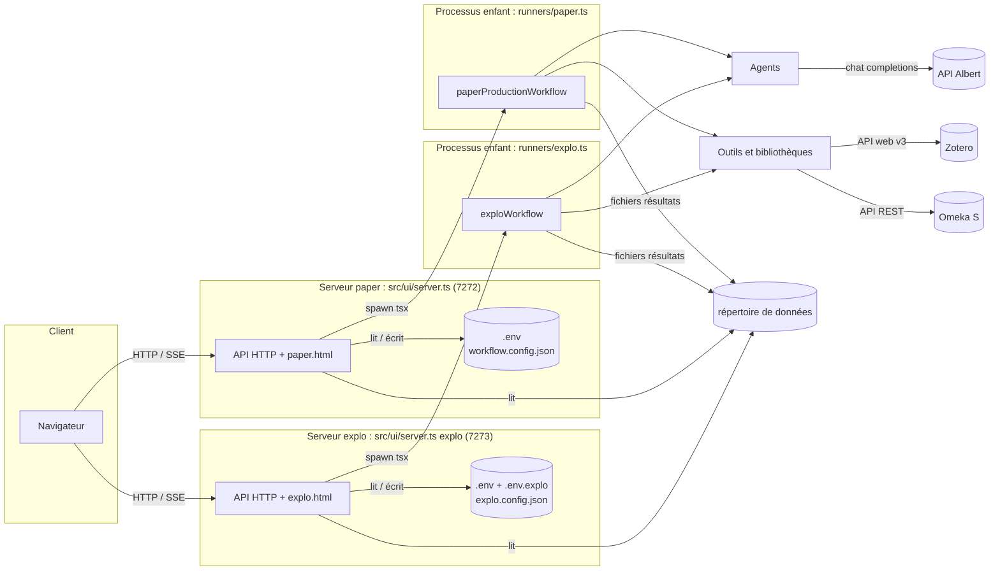
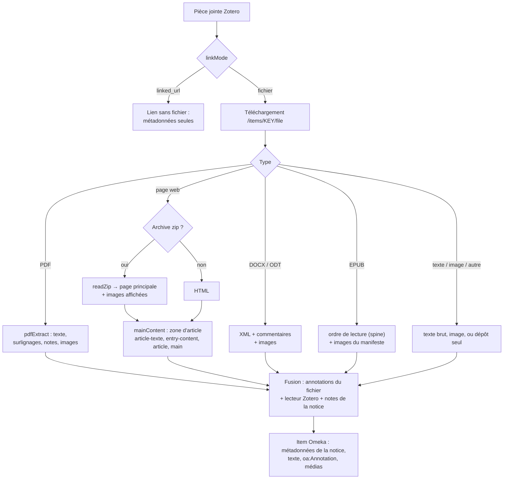
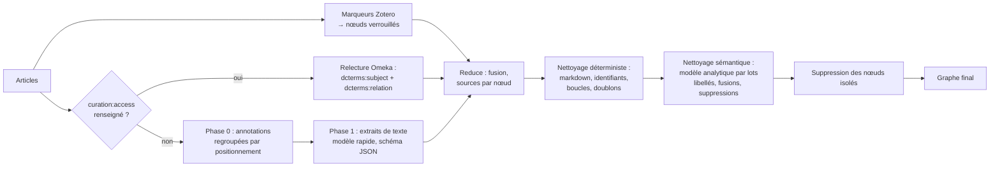
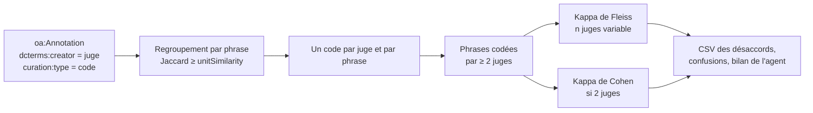
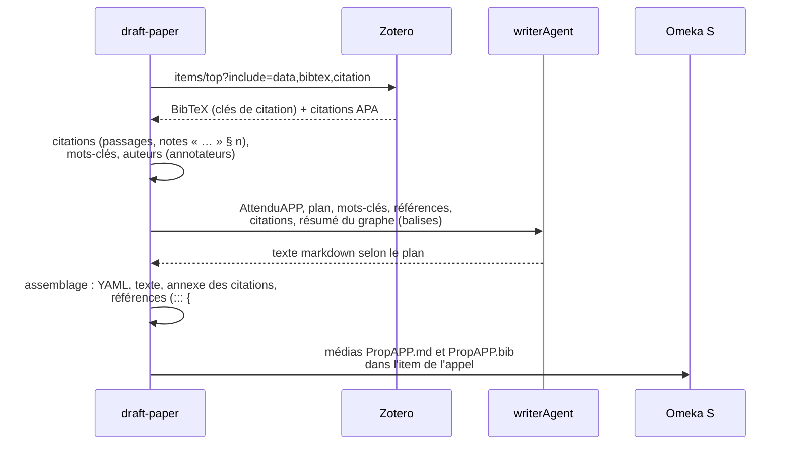
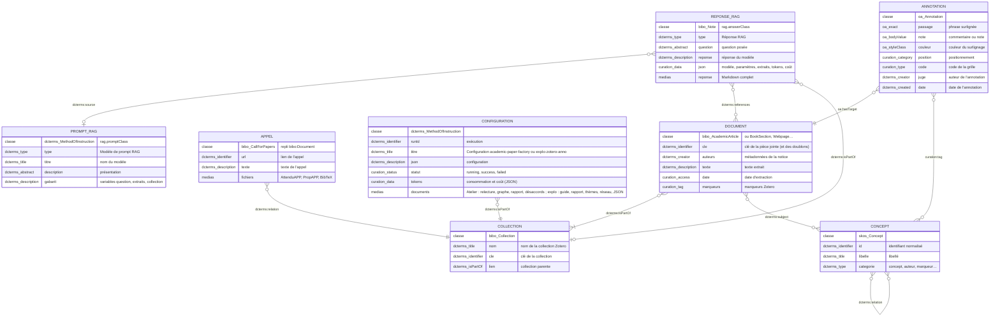
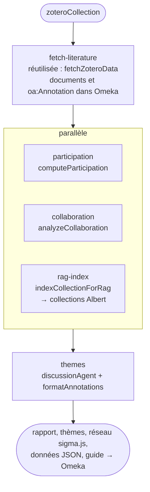
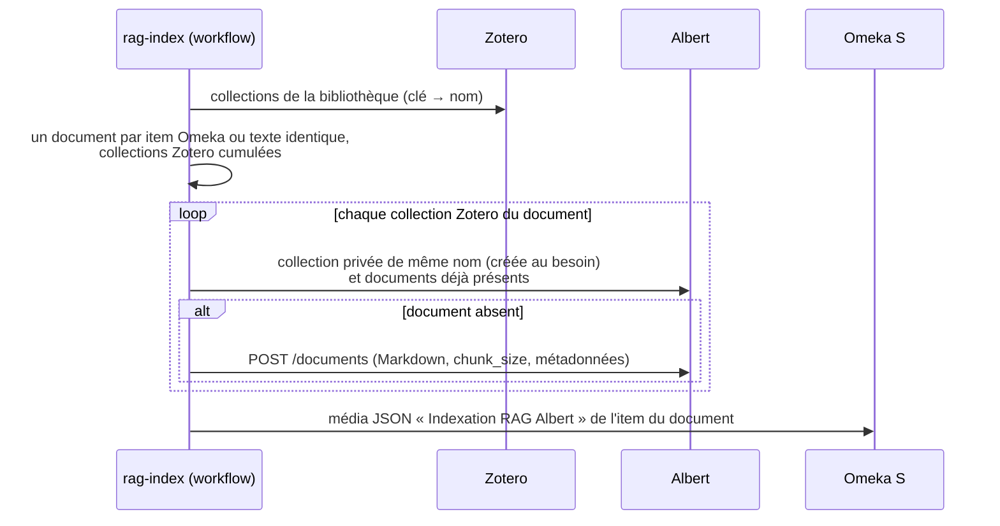
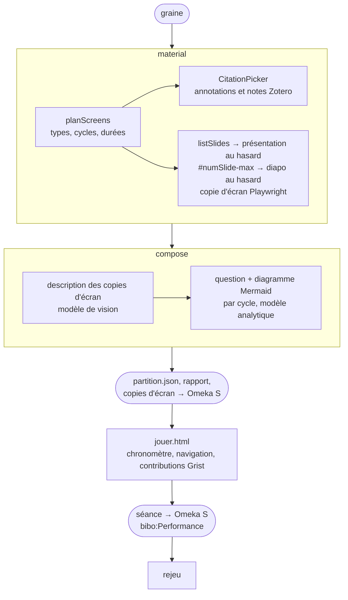

# Documentation technique

Écosystème d'agents IA pour la production d'articles scientifiques (Laboratoire Paragraphe, Université Paris 8). Le projet est écrit en **TypeScript**, exécuté par **tsx** sous **Node.js 22+**, et orchestré par des workflows **Mastra**. Les modèles de langage sont ceux de l'**API Albert** (compatible OpenAI), les sources viennent de **Zotero** et les résultats sont archivés dans **Omeka S**.

Trois applications partagent ce socle, chacune avec son workflow, son lanceur, sa page et son serveur :

| Application | Workflow | Lanceur | Page | Serveur | Section |
|---|---|---|---|---|---|
| Atelier d'articles | `paperProductionWorkflow` (`src/workflow/paperProductionWorkflow.ts`) | `src/runners/paper.ts` | `paper.html` | `PORT` 7272 | 2 |
| exploZoteroAnno | `exploWorkflow` (`src/workflow/exploWorkflow.ts`) | `src/runners/explo.ts` | `explo.html` | `EXPLO_PORT` 7273 | 12 |
| chaoticumSeminario | `chaoticumWorkflow` (`src/workflow/chaoticumWorkflow.ts`) | `src/runners/chaoticum.ts` | `chaoticum.html`, `jouer.html` | `CHAOTICUM_PORT` 7276 | 13 |

Elles partagent (l'Atelier et exploZoteroAnno) l'étape `fetch-literature` (lecture de la collection Zotero et enregistrement dans Omeka S), les bibliothèques de `src/lib/`, le comptage des tokens et l'estimation du coût, l'enregistrement des configurations d'exécution et le serveur `src/ui/server.ts`.

## 1. Architecture



- **Interface** (`src/ui/server.ts`) : serveur `node:http` sans dépendance, lancé une fois par application (voir *Un serveur par application*), qui gère les connexions et la configuration de son application, lance son workflow dans un **processus enfant** (la configuration et les connexions sont ainsi relues à chaque exécution), diffuse le journal en **Server-Sent Events** et sert les résultats.
- **Lanceurs** (`src/runners/paper.ts`, `src/runners/explo.ts`) : enregistrent la configuration dans Omeka S, exécutent le workflow Mastra, produisent les fichiers de résultats (graphe ou réseau sigma.js, rapport de traitement…) et importent les documents de fin d'analyse dans l'item de configuration de l'exécution.
- **Paramètres de connexion** : page commune `src/ui/public/settings.html`, servie par chaque serveur sur `/parametres` ; elle enregistre les connexions de l'application qui la sert (`.env`, ou `.env.explo` pour exploZoteroAnno). Les pages des applications n'enregistrent que leur configuration.
- **RAG Albert** (exploZoteroAnno) : l'indexation est une étape du workflow (processus enfant) ; la consultation, les modèles de prompt et l'enregistrement des réponses sont des routes du serveur (`src/lib/rag/ragQuery.ts`), qui appellent directement Albert et Omeka S avec les connexions du serveur.
- **Répertoire de données** : le répertoire courant. En local c'est la racine du projet ; dans Docker c'est le volume `/data`, le code étant dans `/app`.

## 2. Le workflow de l'Atelier d'articles

Le workflow exploZoteroAnno est décrit à la section 12.


Défini dans `src/workflow/paperProductionWorkflow.ts`, étapes dans `src/workflow/steps/`. Règles de passage des données dans Mastra :

- après un `.parallel([...])`, l'étape suivante reçoit `{ "<id étape>": sortie, ... }` ;
- après un `.then(...)`, elle reçoit directement la sortie de l'étape précédente ;
- `getStepResult("<id>")` donne accès à la sortie de n'importe quelle étape antérieure (utilisé par `draft-paper`).

| Étape | Fichier | Entrées | Sorties principales |
|---|---|---|---|
| `analyze-cfp` | `analyzeCfpStep.ts` | paramètres de l'appel | `cfpAnalysis` (AttenduAPP), `aapItemId`, `aapTitle`, `aapUrl` |
| `fetch-literature` | `fetchLiteratureStep.ts` | `zoteroCollection` | `articles[]`, `collectionItemId` |
| `build-wiki` | `buildWikiStep.ts` | articles, AttenduAPP | `conceptGraph`, `extractedKeys`, `wikiMetadata` |
| `kappa-analysis` | `kappaAnalysisStep.ts` | `collectionItemId` | `kappa`, `confusions`, `summary` |
| `normalize-okf` | `normalizeOkfStep.ts` | graphe, articles | `exportResult` (`omekaIds`, `stats`) |
| `draft-paper` | `draftPaperStep.ts` | graphe + `getStepResult` | `draft` (PropAPP), `proposal` |
| `review-paper` | `reviewPaperStep.ts` | PropAPP, AttenduAPP | `finalReview` |

Les outils sont appelés **directement** par les étapes (`outil.execute({ data })`) : les données brutes circulent entre les étapes sans passer par un modèle. Les agents ne reçoivent que ce qu'ils doivent rédiger ou analyser.

## 3. Organisation du code

```
src/
├── agents/                   agents Mastra, un fichier par agent (index.ts ré-exporte)
├── config/
│   ├── index.ts              configuration de l'Atelier (defaultWorkflowConfig, workflowConfig, outputPath)
│   ├── explo.ts              configuration d'exploZoteroAnno (defaultExploConfig, exploConfig, exploGrid)
│   ├── chaoticum.ts          configuration de chaoticumSeminario (defaultChaoticumConfig, chaoticumConfig, SCREEN_TYPES)
│   ├── models.ts             modèles Albert (analytique, rapide)
│   └── store.ts              fusion avec workflow.config.json / explo.config.json
├── lib/                      fonctions et clients utilisés par les outils et les étapes (hors outils Mastra)
│   ├── chaoticum/            slides (présentations, #numSlide-max, copies d'écran), citations, partition, grist, random
│   ├── analysis/             cleanGraph, annotationPositions (grille de couleurs), codebook (grille kappa)
│   ├── extraction/           pdfExtract, attachmentExtract, zip, chunkText
│   ├── metrics/              usage (tokens), impact (énergie, carbone, argent)
│   ├── omeka/                omk (client), oaAnnotations, conceptIndex, conceptStore, zoteroCollections, verify
│   ├── albert/               albert (client de l'API Albert : collections, documents, recherche, complétions)
│   ├── rag/                  ragIndex (indexation d'une collection), ragQuery (modèles de prompt, consultation, réponses)
│   ├── visualization/        graphViz (graphology, sigma.js)
│   └── zotero/               zotero (client), zoteroToOmeka (correspondance des métadonnées), duplicates (doublons)
├── tools/                    outils Mastra uniquement (index.ts ré-exporte)
├── workflow/
│   ├── paperProductionWorkflow.ts   assemblage de l'Atelier d'articles
│   ├── exploWorkflow.ts             assemblage d'exploZoteroAnno
│   ├── chaoticumWorkflow.ts         assemblage de chaoticumSeminario
│   ├── steps/
│   │   ├── common/           fetchLiteratureStep (partagée)
│   │   ├── paper/            analyzeCfp, buildWiki, kappaAnalysis, normalizeOkf, draftPaper, reviewPaper
│   │   ├── explo/            participation, collaboration, ragIndex, themes
│   │   └── chaoticum/        material (citations, diapos, copies d'écran), compose (vision, questions, diagrammes)
│   ├── reports/              paperReport, exploReport, chaoticumReport, annotationGuide
│   └── runs/                 saveWorkflowConfig (item Omeka), importSynthesis (médias), history (historique local)
├── runners/                  lanceurs : paper.ts (npm start), explo.ts (npm run explo), chaoticum.ts (npm run chaoticum)
└── ui/
    ├── server.ts             serveur d'une application (npm run ui / ui:explo / ui:chaoticum)
    ├── chaoticumRoutes.ts    routes de chaoticumSeminario (partitions, lecteur, contributions, séances)
    └── public/               paper.html, explo.html, chaoticum.html, jouer.html (lecteur), settings.html (page Paramètres commune)
```

Hors de `src/` : `docs/` (documentation, `grille_annotation.md`), `scripts/build-docs.ts`, `docker/entrypoint.sh`, `.vscode/launch.json` (configurations de débogage des workflows et des serveurs), `install/` (instance Omeka S préparée, distribuée à part). Les fichiers produits vont dans `resultats/atelier/`, `resultats/explo/` et `resultats/chaoticum/` (réglages `outputDir`), dans le répertoire de données : la racine du projet en local, le volume `data/` avec Docker.

### Agents (`src/agents/`)

| Agent | Modèle | Rôle |
|---|---|---|
| `aapAnalystAgent` | analytique | analyse des attendus de l'appel (AttenduAPP, markdown) |
| `writerAgent` | analytique | rédaction de PropAPP selon le plan, citations Pandoc |
| `epistemologistAgent` | analytique | relecture critique de PropAPP au regard d'AttenduAPP |
| `kappaAnalystAgent` | analytique | bilan de l'accord inter-juges et recommandations de recalibrage |
| `discussionAgent` | analytique | exploZoteroAnno : thèmes de discussion à partir des passages convergents et divergents |
| `librarianAgent`, `wikiArchitectAgent`, `ontologistAgent` | rapide / analytique | agents outillés disponibles pour un usage conversationnel |

### Outils (`src/tools/`) et bibliothèques (`src/lib/`)

Les **outils** (`fetchCfp`, `fetchZoteroData`, `buildLLMWiki`, `exportToOpenKnowledge`, `compileCollection`, `fetchOmekaAnnotations`, `calculateFleissKappa`, `computeParticipation`, `analyzeCollaboration`) sont des outils Mastra : appelables par les agents, ils sont exécutés directement par les étapes. Les autres modules sont des bibliothèques de `src/lib/`.

| Module | Rôle |
|---|---|
| `fetchCfp` | télécharge ou lit l'appel (URL ou fichier local), extrait le texte, crée ou met à jour l'item Omeka de l'appel |
| `fetchZoteroData` | parcourt la collection, regroupe les doublons (option `mergeDuplicates`), extrait chaque pièce jointe, fusionne annotations et notes, enregistre documents, annotations et médias dans Omeka |
| `duplicates` | `groupDuplicates` : documents en double d'une collection (fichier, DOI, URL, titre et année), exemplaire principal |
| `attachmentExtract` | extraction par format : PDF, page web enregistrée (zip), HTML, DOCX, ODT, EPUB, texte, image |
| `pdfExtract` | PDF.js : texte, surlignages (reconstruction par quadPoints), notes, auteur, images (encodage PNG via zlib) |
| `zip` | lecteur ZIP minimal (répertoire central + zlib) |
| `zotero` | client de l'API Zotero v3 : bibliothèque personnelle ou de groupe, pagination, notes, annotations, BibTeX |
| `zoteroToOmeka` | correspondance métadonnées Zotero → dcterms / bibo / curation |
| `zoteroCollections` | items Omeka des collections Zotero (création à la demande, sous-collections) |
| `omk` | client de l'API REST Omeka S (formatage des valeurs, liens, upload de médias) |
| `oaAnnotations` | enregistrement et relecture des `oa:Annotation` |
| `buildLLMWiki` | extraction Map-Reduce des concepts (annotations par positionnement, marqueurs, extraits de texte) |
| `cleanGraph` | nettoyage déterministe puis sémantique (modèle analytique) du graphe |
| `conceptIndex` | recherche d'un concept existant (identifiant ou titre) avant création |
| `conceptStore` | relecture du graphe d'un document déjà extrait |
| `exportToOpenKnowledge` | concepts, relations, liens document → concepts, date d'extraction |
| `annotationPositions` | couleur → positionnement (distance RVB) |
| `codebook` | codes de la grille d'annotation (kappa) |
| `fetchOmekaAnnotations` | annotations codées par juge, regroupées par phrase (similarité de Jaccard) |
| `calculateFleissKappa` | kappa de Fleiss (nombre de juges variable), kappa de Cohen, CSV des désaccords |
| `compileCollection` | références BibTeX, citations, mots-clés, auteurs pour PropAPP |
| `chunkText` | découpage des textes en extraits avec chevauchement |
| `computeParticipation` | exploZoteroAnno : participation par collaborateur, document, couleur de la grille et semaine |
| `analyzeCollaboration` | exploZoteroAnno : passages communs, convergences et divergences, kappa, réseau collaborateurs–documents |

### Comptage des tokens (`src/lib/metrics/usage.ts`)

Chaque appel à un modèle, dans l'un ou l'autre workflow, enregistre sa consommation avec `recordUsage(source, modèle, usage)` : `totalUsage` pour les agents Mastra (appels d'outils compris), `usage` pour `generateObject` du SDK `ai`. Le workflow tourne dans un seul processus : le compteur est partagé par toutes les étapes, et `usageSummary()` fournit le détail par traitement et par modèle au rapport de traitement, à l'item de configuration (`curation:data`, JSON) et à l'historique. Un appel en erreur n'est pas compté.

### Estimation du coût (`src/lib/metrics/impact.ts`)

`estimateImpact(usageSummary())` convertit les tokens de chaque modèle en énergie, carbone et argent, avec les hypothèses de `config.costs` :

- énergie par token (J) = 2 × paramètres actifs × 10⁹ ÷ (`hardware.flopsPerJoule` × `hardware.utilization`) × `hardware.pue` ;
- émissions (g CO₂e) = énergie (kWh) × `carbonIntensity` ; coût de l'électricité = énergie (kWh) × `electricityPrice` ;
- coût équivalent API = tokens d'entrée × `inputPricePerM` + tokens de sortie × `outputPricePerM` (par million) ; un modèle absent de `costs.models` prend les valeurs de `costs.fallback`.

Le résultat alimente la section « Coût du traitement » du rapport, l'item de configuration (`curation:data`, avec les tokens) et l'historique.

### Historique des exécutions (`src/workflow/runs/history.ts`)

À la fin de chaque exécution de l'Atelier d'articles, `src/runners/paper.ts` ajoute une entrée à `workflow.history.json` (répertoire de données, 500 entrées au plus ; chemin modifiable par `WORKFLOW_HISTORY_FILE`) : identifiant, dates, statut, paramètres d'entrée, appel (titre, item), collection, configuration, titre de la proposition, tokens. L'interface fusionne cet historique avec les items de configuration d'Omeka S (`GET /api/history`) et regroupe les exécutions par appel (lien, fichier ou empreinte du texte). exploZoteroAnno ne tient pas d'historique local : ses exécutions sont retrouvées par leurs items de configuration dans Omeka S.

## 4. Extraction des documents



Clé de fusion des annotations : phrase normalisée, commentaire, auteur et code (deux juges peuvent annoter la même phrase). Quand les doublons sont fusionnés (exploZoteroAnno), seul l'exemplaire principal de chaque groupe suit ce parcours ; les annotations du lecteur, les notes, les annotations incrustées dans les PDF et les marqueurs des autres exemplaires sont ajoutés à la fusion (voir section 12). Les codes de la grille présents dans les marqueurs sont séparés des marqueurs ordinaires (`splitCodes`).

## 5. Graphe de concepts



- Les nœuds **verrouillés** (marqueurs) et **connus** (déjà dans Omeka) ne sont ni renommés ni supprimés par le nettoyage sémantique.
- Chaque nœud garde ses `sources` (clés Zotero des pièces jointes) à travers les fusions : elles servent aux liens `dcterms:subject`.
- Un article n'est marqué extrait (`curation:access`) qu'après une extraction sans erreur et l'export de ses concepts.

## 6. Accord inter-juges



Kappa de Fleiss généralisé : P̄ = moyenne des Pᵢ = (Σⱼ nᵢⱼ² − nᵢ) / (nᵢ(nᵢ − 1)), Pₑ = Σⱼ pⱼ² avec pⱼ = Σᵢ nᵢⱼ / Σᵢ nᵢ. Le calcul est validé sur l'exemple de référence de Fleiss (κ = 0,210) et celui de Cohen (κ = 0,4).

## 7. Proposition d'article (PropAPP)



PropAPP est compatible **Pandoc** : `pandoc PropAPP.md --citeproc -o PropAPP.docx` produit un document avec la bibliographie (le fichier `PropAPP.bib` doit être à côté).

## 8. Modèle de données Omeka S



Les deux workflows écrivent dans ce même modèle : documents, annotations, concepts et collections sont partagés ; l'appel n'existe que pour l'Atelier ; chaque exécution, de l'une ou l'autre application, crée un item de configuration (identifiant de workflow `academic-paper-factory` ou `explo-zotero-anno`). exploZoteroAnno lit les termes Omeka de la configuration de l'Atelier (`workflowConfig.omeka`). Les termes utilisés sont paramétrables dans `config.omeka` (`accessTerm`, `subjectTerm`, `relationTerm`, `codeTerm`, `authorTerm`, `conceptClass`, `configClass`, `cfpClass`).

## 9. Configuration

Chaque application a sa configuration par défaut et son fichier de surcharges :

| | Atelier d'articles | exploZoteroAnno |
|---|---|---|
| Défauts | `src/config/index.ts` (`defaultWorkflowConfig`) | `src/config/explo.ts` (`defaultExploConfig`) |
| Surcharges | `workflow.config.json` (`WORKFLOW_CONFIG_FILE`) | `explo.config.json` (`EXPLO_CONFIG_FILE`) |
| Configuration effective | `workflowConfig` | `exploConfig` |

Les modifications faites dans l'interface sont enregistrées dans le fichier de surcharges (seules les différences, `writeConfigOverride`) et fusionnées au chargement (`mergeConfig` et `readConfigOverride` de `src/config/store.ts`). Les chemins `kappa.codes`, `annotationPositions`, `omeka.vocabs`, `steps` et `costs.models` sont remplacés en bloc, les autres objets sont fusionnés clé par clé.

**Atelier d'articles** (`defaultWorkflowConfig`) :

| Clé | Rôle |
|---|---|
| `input.cfpUrl`, `input.cfpFile`, `input.cfpText` | appel à propositions : lien, fichier local, texte ou précisions |
| `input.zoteroCollection` | clé de la collection Zotero |
| `models.provider`, `models.analytics`, `models.fast` | API Albert et modèles |
| `zotero.automaticTags` | inclure les marqueurs automatiques |
| `extraction.chunkSize`, `chunkOverlap`, `maxAnnotationChars` | découpage des textes, taille du bloc d'annotations |
| `tagCategory` | catégorie des concepts issus des marqueurs |
| `annotationPositions`, `annotationColorTolerance` | table couleur → positionnement → consigne |
| `kappa.codes`, `unitSimilarity`, `targetKappa`, `csvPath` | accord inter-juges |
| `proposal.plan`, `authors`, `maxKeywords`, `ignoredTags`, `maxCitations`, `citationStyle` | PropAPP |
| `proposal.expectationsFile`, `proposalFile`, `bibtexFile` | noms des fichiers produits |
| `cleaning.batchSize` | taille des lots de nettoyage sémantique |
| `costs.*` | estimation du coût : devise, prix de l'électricité, intensité carbone, matériel (rendement, utilisation, PUE), paramètres actifs et tarifs de référence par modèle |
| `omeka.*` | vocabulaires, classes et propriétés |

**exploZoteroAnno** (`defaultExploConfig`) ; les modèles, l'extraction, les coûts et les termes Omeka sont repris de la configuration de l'Atelier :

| Clé | Rôle |
|---|---|
| `workflowId` | identifiant du workflow (`explo-zotero-anno`), titre de l'item de configuration |
| `input.zoteroCollection` | clé de la collection Zotero (par défaut celle de l'Atelier) |
| `grid.title`, `grid.introduction` | titre et introduction du guide d'annotation |
| `grid.positions`, `grid.tolerance` | grille de couleurs (couleur, nom, signification, consigne) et distance RVB maximale de rattachement |
| `analysis.unitSimilarity` | taux de recouvrement des mots (Jaccard) pour que deux surlignages portent sur le même passage |
| `analysis.unassignedLabel` | nom des annotations sans auteur |
| `analysis.mergeDuplicates` | fusion des documents en double (`true` par défaut) |
| `analysis.minPassagesForKappa` | nombre minimum de passages communs pour calculer un kappa |
| `themes.count`, `themes.maxPassages` | nombre de thèmes, passages transmis à l'agent |
| `rag.enabled`, `rag.allCollections` | indexation dans Albert à chaque analyse ; dépôt aussi dans les autres collections Zotero du document |
| `rag.chunkSize`, `rag.chunkOverlap` | découpage des documents par Albert (caractères ; séparateurs Markdown) |
| `rag.embeddingsModel` | modèle de vectorisation (estimation du coût, `costs.models`) |
| `rag.limit`, `rag.method`, `rag.scoreThreshold` | consultation : nombre d'extraits, recherche `hybrid`, `semantic` ou `lexical`, seuil (sémantique) |
| `rag.system` | instructions générales du modèle |
| `rag.promptType`, `rag.promptClass`, `rag.answerType`, `rag.answerClass` | repérage et classes Omeka S des modèles de prompt et des réponses |
| `rag.defaultPrompts` | modèles proposés par « Créer les modèles par défaut » |
| `outputDir` | dossier des fichiers produits (`resultats/explo`) |

## 10. API de l'interface

Routes communes aux deux serveurs (chacune s'applique à l'application du serveur) :

| Méthode et route | Rôle |
|---|---|
| `GET /` | page de l'application (`paper.html` ou `explo.html`) |
| `GET /api/settings` | connexions (secrets masqués, valeurs héritées signalées pour exploZoteroAnno), configuration effective et par défaut |
| `POST /api/settings` | enregistre les connexions (`.env` ou `.env.explo` ; un secret vide est conservé) et la configuration |
| `POST /api/check` | teste Albert, Zotero et Omeka S (vocabulaires, clé d'écriture par un `PATCH` sur un item inexistant : 404 = valide, 403 = refusée) |
| `GET /api/zotero/collections` | collections de la bibliothèque enregistrée |
| `POST /api/zotero/collections` | collections de la bibliothèque saisie dans le formulaire (`{ userId, groupId, apiKey }`, non encore enregistrée) |
| `GET /parametres` | page des connexions (`settings.html`) |
| `GET /api/apps` | application du serveur, adresses des deux applications (liens entre elles), fichiers de connexion |
| `GET /api/albert/models` | modèles disponibles |
| `POST /api/run`, `POST /api/run/stop`, `GET /api/run` | lancer, arrêter, état |
| `GET /api/run/events` | journal et statut en Server-Sent Events |
| `GET /docs/…` | documentation HTML |

Routes propres à l'Atelier d'articles :

| Méthode et route | Rôle |
|---|---|
| `POST /api/cfp-file?name=` | importe le fichier de l'appel dans `aap/` |
| `GET /api/results`, `GET /api/file?name=` | liste et contenu des résultats (liste blanche) |
| `GET /api/history` | appels traités : historique local et configurations Omeka S, regroupés par appel |

Routes propres à exploZoteroAnno : `GET` et `POST /api/explo/settings`, `POST /api/explo/guide` (guide d'annotation à partir de la grille), `GET /api/explo/runs` (analyses déjà effectuées), `GET /api/explo/results?run=`, `GET /api/explo/file?name=&run=` (sans `run` : dernière analyse), et pour le RAG :

| Méthode et route | Rôle |
|---|---|
| `GET /api/explo/rag/status?collection=` | collection Albert de même nom que la collection Zotero : identifiant, nombre de documents |
| `GET`, `POST /api/explo/rag/prompts` | liste, création ou modification (`{ id?, title, description, template }`) d'un modèle de prompt dans Omeka S |
| `POST /api/explo/rag/prompts/defaults` | crée les modèles par défaut absents (comparaison sur le titre) |
| `POST /api/explo/rag/query` | `{ collection, promptId, question, limit?, method?, model? }` : recherche, réponse, extraits, coût ; la réponse est gardée en mémoire (30 au plus) sous un identifiant |
| `POST /api/explo/rag/save` | `{ id }` : enregistre la réponse dans Omeka S, renvoie l'item créé |
| `GET /api/explo/rag/answers?collection=` | réponses enregistrées pour la collection |

Une route de l'autre application répond 404. Chaque serveur écoute sur `127.0.0.1` (`HOST`, ou `EXPLO_HOST` pour exploZoteroAnno ; `0.0.0.0` dans le conteneur) et sur son port : `PORT` (7272) ou `EXPLO_PORT` (7273). Un seul traitement à la fois par serveur (`POST /api/run` répond 409 si un traitement est en cours).

## 11. Étendre le projet

**Ajouter un outil** : créer `src/tools/monOutil.ts` sur le modèle des outils existants (`new Tool({ name, description, schema, execute: async ({ data }) => … })`, schéma zod typé avec `z.infer`), puis l'exporter dans `src/tools/index.ts`.

**Ajouter une étape à l'Atelier** : créer `src/workflow/steps/paper/monEtape.ts` (ou `common/` si elle est partagée) avec `createStep({ id, execute })`, l'insérer dans `paperProductionWorkflow.ts`, ajouter son identifiant à `config.steps` et son libellé dans `STEP_LABELS` (`src/workflow/reports/paperReport.ts`).

**Ajouter une étape à exploZoteroAnno** : créer `src/workflow/steps/explo/monEtape.ts`, l'insérer dans `exploWorkflow.ts`, lire sa sortie dans `src/runners/explo.ts` (fichiers, documents importés dans Omeka) et l'ajouter au rapport (`src/workflow/reports/exploReport.ts`).

**Ajouter un paramètre à l'Atelier** : l'ajouter à `defaultWorkflowConfig` ; il apparaît automatiquement dans l'interface (ajouter un libellé dans `LABELS`, et la section dans `SECTIONS`, de `paper.html`).

**Ajouter un paramètre à exploZoteroAnno** : l'ajouter à `defaultExploConfig`, puis le champ dans l'onglet Grille d'`explo.html` (affichage dans le rendu des réglages, mise à jour de `config` par `bind` ou un gestionnaire `onchange`).

**Ajouter une application** : déclarer une entrée dans `APPS` (`src/ui/server.ts` : lanceur, page, fichiers de connexions, variables de port et d'adresse), créer son lanceur dans `src/runners/`, sa page dans `src/ui/public/`, et un service dans `docker-compose.yml`.

## 12. Workflow exploZoteroAnno

Second workflow (`src/workflow/exploWorkflow.ts`, étapes dans `src/workflow/steps/explo/`), consacré à l'annotation collective d'une collection Zotero. Il a sa propre configuration (`defaultExploConfig` dans `src/config/explo.ts`, surcharges dans `explo.config.json`), sa page (`src/ui/public/explo.html`) et **son propre serveur** (voir *Un serveur par application*).



| Élément | Rôle | Réutilise |
|---|---|---|
| `fetch-literature` | collection, annotations (auteur, couleur, date), notes, Omeka | étape et outil de l'Atelier d'articles |
| `groupDuplicates` (`src/lib/zotero/duplicates.ts`) | doublons de la collection (option `analysis.mergeDuplicates`, transmise par `fetch-literature` à `fetchZoteroData`) | clés d'identité `md5`, DOI (aussi dans `extra`), URL normalisée, titre normalisé + année (titres d'au moins 15 caractères) ; regroupement union-find ; exemplaire principal : fichier plutôt que lien, PDF, puis le plus ancien. Seul le principal est extrait et enregistré dans Omeka (`dcterms:identifier` = toutes les clés Zotero) ; annotations du lecteur, notes, annotations incrustées dans les PDF et marqueurs des doublons lui sont ajoutés (dédoublonnés sur passage, note, auteur, code) ; `articles[].duplicates` décrit les exemplaires fusionnés |
| `computeParticipation` | par collaborateur, document, couleur de la grille, semaine | `positionForColor` avec la grille de l'exploration |
| `analyzeCollaboration` | passages communs, paires, convergences et divergences, kappa, réseau | `words` / `jaccard`, `fleissKappa` / `cohenKappa`, `interpretKappa` |
| `rag-index` (`src/lib/rag/ragIndex.ts`) | dépôt des documents dans les collections privées Albert (option `rag.enabled`) | voir *RAG Albert* ci-dessous |
| `discussionAgent` | thèmes de discussion (modèle analytique) | `formatAnnotations` (grille en paramètre), comptage des tokens |
| `src/runners/explo.ts` | lancement (`npm run explo`), fichiers, Omeka, coût | `saveWorkflowConfig`, `updateWorkflowStatus`, `attachDocuments`, `generateGraphHtml`, `usageReport`, `estimateImpact` |
| `src/workflow/reports/annotationGuide.ts` | guide d'annotation à partir de la grille | — |

Fichiers produits dans `resultats/explo/` (réglage `outputDir`) : `guide_annotation.md`, `participation.json`, `collaborations.json`, `reseau_collaborations.html`, `themes_discussion.md`, `rapport_explo.md`, `rag_indexation.json` (bilan de l'indexation). Ces fichiers sont ceux de la **dernière analyse** ; chaque analyse est aussi archivée dans `resultats/explo/analyses/<runId>/` (copie des fichiers et `analyse.json` : statut, dates, collection, item de configuration, tokens, coût, totaux, configuration).

### Analyses déjà effectuées

`GET /api/explo/runs` fusionne l'archive locale et les items de configuration d'Omeka S dont la description porte `workflowId = explo-zotero-anno` (l'historique de l'Atelier écarte ces items, et inversement). `GET /api/explo/results?run=` et `GET /api/explo/file?name=&run=` servent les fichiers d'une analyse : archive locale si elle existe, sinon médias de l'item de configuration (repérés par leur `dcterms:identifier` `<runId>/<fichier>`, lus par leur `o:original_url`). L'identifiant d'analyse est validé (`[\w-]`) et seuls les noms de fichiers connus sont servis. La page garde l'analyse affichée dans `currentRun` (`null` = dernière analyse) et ajoute `run=` à ses requêtes.

### RAG Albert

Mise en œuvre du [guide RAG d'Albert](https://guides.ia.numerique.gouv.fr/albert-api/guides/rag) avec le client `src/lib/albert/albert.ts` (`/v1/collections`, `/v1/documents`, `/v1/search`, `/v1/chat/completions`).



- **Une collection Albert par nom de collection Zotero** (`ensureCollection` : la plus ancienne collection privée de ce nom, sinon création). Deux collections Zotero de même nom partagent donc la même collection Albert.
- **Un dépôt par document** : les exemplaires fusionnés par `fetchZoteroData` n'en font qu'un, et les articles de même texte (fusion désactivée, même PDF rattaché à deux notices) sont regroupés par empreinte SHA-1 du texte normalisé, leurs collections étant cumulées. Avec `rag.allCollections`, le document est déposé dans la collection Albert de chacune de ses collections Zotero (`articles[].collectionKeys`, doublons compris) ; sinon dans celle de la collection analysée seulement.
- **Idempotence** : le nom du document Albert commence par un identifiant stable (`omeka-<item>`, à défaut `zotero-<clé>`) ; les documents déjà présents dans la collection Albert ne sont pas redéposés.
- **Contenu déposé** : Markdown (titre, auteurs, année, clés Zotero et Omeka, texte extrait), découpé par Albert (`chunk_size`, `chunk_overlap`, séparateurs `markdown`) ; métadonnées recopiées sur chaque extrait : `omeka_id`, `zotero_key`, `title`, `creators`, `year`, `zotero_collection`. Un texte de plus de 5 millions de caractères est déposé en plusieurs parties (limite de 20 Mo).
- **Trace** : à chaque nouveau dépôt, un média JSON « Indexation RAG Albert » est déposé sur l'item du document (collections Zotero et Albert, identifiants des documents Albert, statut `créé` ou `déjà présent`, taille, tokens estimés, découpage) ; il remplace la trace précédente de l'application. Extension refusée : dépôt en `.json.txt`.
- **Consultation** (`queryRag`) : recherche dans la collection Albert, gabarit du modèle de prompt rempli (`{{question}}`, `{{extraits}}` numérotés avec leur référence, `{{collection}}`), complétion avec `rag.system` en message système et le modèle choisi (modèle analytique par défaut).
- **Coût** : l'indexation enregistre une estimation des tokens vectorisés (`texte / 4`, modèle `rag.embeddingsModel`) dans le compteur du workflow, donc dans le rapport et l'item de configuration ; chaque consultation calcule son coût (`estimateImpact`) à partir des tokens renvoyés par Albert pour la recherche et la complétion (estimés si absents), et rapporte aussi le coût et les impacts déclarés par Albert (nuls tant que la plateforme ne facture pas).

Pour permettre ce suivi, deux évolutions profitent aux deux workflows : la date des annotations et des notes Zotero est conservée (`dcterms:created` sur l'`oa:Annotation`), et les nouvelles annotations du lecteur Zotero sont synchronisées pour les documents déjà présents dans Omeka S. Les briques communes acceptent désormais un paramètre : grille de couleurs (`positionForColor`, `formatAnnotations`), fichier de configuration (`readConfigOverride`, `writeConfigOverride`), fichier d'historique (`appendHistory`), workflow décrit (`saveWorkflowConfig`).

API propre au serveur exploZoteroAnno : `GET` et `POST /api/explo/settings`, `POST /api/explo/guide`, `GET /api/explo/results`, `GET /api/explo/file?name=`.

### Un serveur par application

`src/ui/server.ts` sert **une** application, choisie en argument (`tsx src/ui/server.ts explo`) ou par `WORKFLOW_APP` (`paper` par défaut). Chaque serveur a son paramétrage :

| | Atelier d'articles (`paper`) | exploZoteroAnno (`explo`) | chaoticumSeminario (`chaoticum`) |
|---|---|---|---|
| Lancement | `npm run ui` | `npm run ui:explo` | `npm run ui:chaoticum` |
| Port / adresse d'écoute | `PORT` (7272) / `HOST` | `EXPLO_PORT` (7273) / `EXPLO_HOST` (ou `HOST`) | `CHAOTICUM_PORT` (7276) / `CHAOTICUM_HOST` (ou `HOST`) |
| Connexions | `.env` | `.env` surchargé par `.env.explo` (`EXPLO_ENV_FILE`) | `.env` surchargé par `.env.chaoticum` (`CHAOTICUM_ENV_FILE`) |
| Configuration | `workflow.config.json` | `explo.config.json` | `chaoticum.config.json` |
| Workflow lancé | `src/runners/paper.ts` | `src/runners/explo.ts` | `src/runners/chaoticum.ts` |
| Page | `paper.html` | `explo.html` | `chaoticum.html` (et `/jouer` : `jouer.html`) |

Chaque serveur a son propre traitement en cours (les applications peuvent traiter simultanément) et son propre flux de journal. Routes communes : `/api/settings` (connexions et configuration de l'application du serveur ; un secret vide est conservé, une valeur identique à la valeur héritée n'est pas recopiée dans `.env.explo`), `/api/check`, `/api/zotero/collections`, `/api/albert/models`, `/api/run*`, `/docs/`, et `GET /api/apps` (adresses des applications, `PAPER_URL` / `EXPLO_URL` / `CHAOTICUM_URL` ou port local, pour les liens entre elles). Les routes propres aux autres applications répondent 404 ; l'ancienne adresse `/explo` de l'Atelier redirige vers le serveur d'exploZoteroAnno.

## 13. Workflow chaoticumSeminario

Troisième workflow (`src/workflow/chaoticumWorkflow.ts`, étapes dans `src/workflow/steps/chaoticum/`, bibliothèques dans `src/lib/chaoticum/`) : il génère la **partition** d'une conférence ; le lecteur `jouer.html` la joue et enregistre les **séances**. Configuration : `defaultChaoticumConfig` (`src/config/chaoticum.ts`), surcharges dans `chaoticum.config.json`.



| Élément | Rôle |
|---|---|
| `loadTheme`, `rankByTheme` (`theme.ts`) | thème de la conférence : titre, description, texte du programme (`programUrl`, page web ou PDF lu par `extractAttachment`) ; avec `selection.byTheme`, le modèle analytique choisit les citations (parmi `selection.citationCandidates` tirées au hasard) et les présentations (`selection.slideShortlist`, d'après les textes de leur SVG, `slideText`) les plus proches du thème ; le hasard départage et complète si le choix échoue |
| index RAG (`src/lib/chaoticum/index/`) | `slidesIndex` : collection Albert `rag.slidesCollection`, un document par diapo (titre, mots-clés et description par le modèle de vision, `generateObject` avec l'image ; métadonnées `kind`, `path`, `diapo`, `max`) ; chaque présentation est chargée une fois et ses diapos capturées en fixant le `viewBox` du SVG (`slides[keys[n]]`, sans transition, environ 0,4 s par diapo) ; descriptions et dépôts en parallèle (4) ; reprise incrémentale, `rag.slidesPerRun` par exécution. `zoteroIndex` : collection `rag.zoteroCollection`, un document par notice, lu en quatre requêtes paginées (notices, pièces jointes, notes, annotations) ; mots-clés répétés `rag.keywordsWeight` fois et notes `rag.notesWeight` fois en tête, passages surlignés marqués `[[CLÉ]]` ; empreinte du contenu pour ne redéposer que les références modifiées, références supprimées retirées. État local : `resultats/chaoticum/index/diapos.json` et `bibliotheque.json` (+ copies d'écran dans `index/diapos/`). Lancement : `npm run chaoticum:index -- diapos|bibliotheque|tout`, ou `POST /api/run?task=index-diapos|index-bibliotheque` |
| `ragMaterial` (`ragSelect.ts`) | génération à partir des index : une requête par cycle tirée du thème (`generateObject`), recherche hybride dans les deux collections (filtre `collections` sur la collection Zotero choisie), citations retrouvées par leurs marqueurs `[[CLÉ]]` dans les extraits, candidats complétés au hasard (graine) ; puis un appel par cycle qui choisit les citations et diapos les plus cohérentes avec la conférence et rédige question et diagramme (nœuds, liens). Copies d'écran recopiées depuis l'index ; l'étape `compose` ne fait plus que ce qui manque. Repli sur le tirage direct si les index sont vides ou désactivés (`rag.enabled`) |
| `planScreens` (`partition.ts`) | types d'écran (`pattern` répété jusqu'à `screens`), cycles (un par répétition), durées (`durationMinutes` réparti selon `weights`, arrondi reporté sur le dernier écran) |
| `seededRandom` (`random.ts`) | tirage reproductible (mulberry32 initialisé par l'empreinte de la graine) ; la graine est enregistrée dans la partition |
| `CitationPicker` (`citations.ts`) | collection : annotations des pièces jointes (`/items/<clé>/children?itemType=annotation`) et notes, tirage sans remise ; bibliothèque : tirage d'un rang au hasard parmi toutes les annotations (et notes), un item par requête (`limit=1&start=<rang>`), sans tout charger ; référence remontée annotation → pièce jointe → notice |
| `listSlides`, `maxFromPage`, `screenshot` (`slides.ts`) | présentations : sous-dossiers de `slides.localDir` contenant `slide.html`, sinon arborescence du dépôt GitHub ; nombre de diapos lu dans `#numSlide-max` de la page rendue (Chromium), à défaut compté dans le SVG (rectangles `slide_*` distincts moins un) ; copie d'écran de `slide.html?diapo=<n>` après `settleMs` |
| `composeStep` | vision : `generateText` avec l'image (modèle `models.vision`) ; puis par cycle contenant une question ou un diagramme, `generateObject` (question, intention, titre, nœuds et liens du diagramme) avec les citations et descriptions du cycle (à défaut, des cycles précédents) ; le code Mermaid est construit par `buildMermaid` (`mermaid.ts` : identifiants renumérotés, libellés entre guillemets et nettoyés), donc toujours valide ; une question de plus de 15 mots est reformulée par le modèle rapide. `repairMermaid` corrige les diagrammes écrits directement par un modèle (partitions antérieures : `A --> B:::classe "libellé"`, `classDef`, libellés sans guillemets) ; le lecteur l'applique si le diagramme enregistré ne s'affiche pas, et l'éditeur propose « Réparer automatiquement » |
| `src/runners/chaoticum.ts` | item de configuration, exécution, `partition.json` et `rapport_chaoticum.md` dans `resultats/chaoticum/partitions/<runId>/`, médias Omeka (partition, rapport, PNG), coût |
| `readContributions`, `updateContribution`, `deleteContribution` (`grist.ts`) | lecture par l'API des enregistrements de Grist (document et table déduits du lien de la table : identifiant `grist-<ligne>`, dates converties), à défaut export CSV (identifiant = empreinte de la ligne) ; modification de l'URL (`PATCH …/records`) et suppression (`POST …/data/delete`) avec `GRIST_API_KEY` |
| `frameable` (`grist.ts`) | une URL proposée peut-elle s'afficher dans un iframe (X-Frame-Options, CSP `frame-ancestors`) ; chaque redirection est suivie à la main et les adresses locales ou privées sont refusées (protection contre les requêtes vers le réseau interne) |

**Lecteur** (`jouer.html`, route `/jouer?run=<partition>`) : lien de retour vers la liste, QR code de participation sur chaque écran, zoom et déplacement des diagrammes (transformation CSS, molette, glisser, ajustement), chronomètre par écran (`timer.warning` et `timer.danger` × durée prévue), temps de séance et écart à la partition, navigation (précédent, suivant, début, fin, aller à, revenir, barre des écrans, raccourcis clavier), rendu par type (iframe de la diapo, Mermaid, QR code du formulaire). Les réponses Grist sont lues toutes les `grist.pollSeconds` secondes ; les lignes présentes au démarrage forment la référence, les nouvelles sont des contributions de la séance, rattachées à l'écran affiché à leur arrivée ; avec `grist.moderation`, l'animateur choisit l'URL affichée. Il peut modifier ou supprimer une contribution (`POST /api/chaoticum/contribution`) : appliqué dans Grist si `GRIST_API_KEY` le permet et si la réponse a un identifiant de ligne, sinon pour la séance ; la séance garde ces modifications (`overrides`, `edits`, `deletedAt`), que le rejeu applique à l'instant rejoué. Un brouillon de la séance est gardé dans le stockage local du navigateur (reprise après fermeture).

**Rejeu public** : chaque séance reçoit un jeton aléatoire de 128 bits (`shareToken`, aussi dans `curation:data` de son item Omeka sous `share`). `GET /public/rejeu?t=<jeton>` sert le lecteur en mode public (lecture seule : ni QR code de participation, ni enregistrement, ni modification de contributions, ni lien vers l'application) ; `GET /public/api/rejeu?t=` renvoie la partition et la séance sans adresses du formulaire Grist, item de configuration ni jeton ; `GET /public/api/rejeu/file?t=&name=diapo_n.png` sert les copies d'écran. Le jeton est cherché dans l'archive locale, sinon dans Omeka S. Aucune route publique n'écrit ni ne consulte d'URL externe (l'autorisation d'affichage des contributions est enregistrée pendant la séance, `frameable`). `POST /api/chaoticum/participation/share` crée le lien d'une séance plus ancienne. Le proxy n'exempte de l'authentification que `/public/`.

**Séance** (`POST /api/chaoticum/participation`) : `events` (écran, type, entrée, sortie, secondes, durée prévue, statut `ok` / `warning` / `danger`) et `contributions` (nom, URL, date Grist, réception, écran, affichages) ; archivée dans `resultats/chaoticum/partitions/<runId>/participations/<id>.json` et dans Omeka S (item `omeka.participationClass`, `dcterms:type` `omeka.participationType`, `dcterms:relation` vers la partition, résumé dans `curation:data`, JSON complet en média). **Rejeu** (`/jouer?run=<partition>&replay=<séance>`) : horloge virtuelle qui parcourt les `events` à la vitesse choisie ; les contributions reçues et affichées avant l'instant rejoué sont reconstituées.

| Clé de configuration | Rôle |
|---|---|
| `title`, `description`, `programUrl` | conférence (thème) |
| `rag.enabled`, `rag.slidesCollection`, `rag.zoteroCollection`, `rag.slidesPerRun`, `rag.keywordsWeight`, `rag.notesWeight`, `rag.searchLimit`, `rag.chunkSize`, `rag.chunkOverlap` | index RAG |
| `selection.byTheme`, `selection.citationCandidates`, `selection.slideShortlist` | choix orienté par le thème |
| `screens`, `durationMinutes`, `pattern`, `weights`, `seed` | partition |
| `timer.warning`, `timer.danger` | seuils du chronomètre (× durée prévue) |
| `citations.scope`, `citations.collection`, `includeNotes`, `minLength`, `maxLength` | citations Zotero |
| `slides.siteUrl`, `localDir`, `repo`, `docsPath`, `exclude`, `viewport`, `settleMs` | diapos ConfErrance |
| `grist.formUrl`, `responsesUrl`, `urlColumn`, `nameColumn`, `dateColumn`, `pollSeconds`, `moderation` | contributions |
| `models.vision`, `models.analytics` | modèles Albert |
| `omeka.participationClass`, `omeka.participationType` | séances dans Omeka S |
| `outputDir` | `resultats/chaoticum` |

Routes propres au serveur chaoticumSeminario (`src/ui/chaoticumRoutes.ts`) : `GET /jouer`, `GET /api/chaoticum/partitions`, `GET /api/chaoticum/partition?run=`, `GET /api/chaoticum/file?run=&name=` (partition, rapport, copies d'écran : archive locale, sinon médias Omeka S), `GET /api/chaoticum/contributions?run=`, `POST /api/chaoticum/contribution` (`{ run, rowId, url }` ou `{ run, rowId, remove: true }`), `POST /api/chaoticum/partition/screen` (`{ run, index, changes }` : type, durée, citation, diapo — reprise de la description et de la copie d'écran de l'index —, question, diagramme, consigne de contributions ; nouveau média `partition.json` dans Omeka S, l'ancien est supprimé, nouvelles copies d'écran déposées), `POST /api/chaoticum/partition/structure` (`{ run, op: insert|duplicate|move|delete, index, type?, to? }`), `POST /api/chaoticum/partition/regenerate` (`{ run, index, what: question|diagramme, hint? }` : nouvelle proposition non enregistrée, avec son coût, `regenerate.ts`), `GET /api/chaoticum/index/search?kind=citation|diapo&q=` (recherche locale dans les index, sans appel à Albert), `GET /api/chaoticum/index/screenshot?path=&diapo=`, `GET /editeur-ecran.js` (module de l'éditeur d'écran, partagé par `chaoticum.html` et `jouer.html` : outils par type, éditeur visuel de diagramme qui lit et écrit le format de `buildMermaid`), `GET /api/chaoticum/slides`, `GET /api/chaoticum/index` (état des index RAG), `GET /api/chaoticum/frameable?url=`, `POST /api/chaoticum/participation`, `GET /api/chaoticum/participations?run=`, `GET /api/chaoticum/participation?run=&id=`.

## 14. Documentation et conteneur

- `npm run docs` convertit `docs/*.md` en `docs/html/*.html` (script `scripts/build-docs.ts`, bibliothèque **marked** ; les diagrammes **Mermaid** sont rendus dans le navigateur).
- `Dockerfile` : image `node:22-bookworm-slim`, code dans `/app`, données dans le volume `/data`, Chromium de Playwright (`PLAYWRIGHT_BROWSERS_PATH=/ms-playwright`, avec ses bibliothèques système), commandes `workflow-ui` (serveur de l'application `WORKFLOW_APP`), `workflow`, `workflow-explo` et `workflow-chaoticum` (lignes de commande).
- `docker-compose.yml` : trois services à partir de la même image, `workflow` (Atelier, 7272), `explo` (exploZoteroAnno, 7273) et `chaoticum` (chaoticumSeminario, 7276), publiés sur `127.0.0.1` et partageant `./data`.
- `docker/entrypoint.sh` : le conteneur démarre en root, rétablit si besoin la propriété de `/data` pour l'utilisateur `node` (uid 1000), puis exécute la commande sous `node` avec `setpriv`. Les commandes `workflow`, `workflow-explo` et `workflow-ui` lancées par `docker compose exec` (en root) passent aussi par ce point d'entrée.
- `docker-compose.yml` (suite) : volume `./data:/data` commun, `host.docker.internal` pour un Omeka S local ; le contrôle de santé interroge le port de l'application du conteneur (`WORKFLOW_APP`).
- `.vscode/launch.json` : débogage des trois workflows sans interface, des trois serveurs sur 7282, 7283 et 7286 (avec suivi du workflow lancé en processus enfant) et du fichier courant.

## 15. Limites connues

- `tsc --noEmit` signale des erreurs de typage liées à la configuration TypeScript (CommonJS avec `verbatimModuleSyntax`) et aux types Mastra (étapes sans schéma) ; l'exécution par tsx n'est pas affectée.
- La reconstruction des passages surlignés d'un PDF est une approximation proportionnelle à la largeur des blocs de texte.
- Les sites protégés contre les robots ne peuvent pas être téléchargés : utiliser un fichier local.
- Le contexte des modèles limite la taille des textes transmis (appel très long, plan très détaillé).
- exploZoteroAnno : le repli « même titre et même année » peut fusionner deux documents distincts au titre identique (comptes rendus, éditions successives) ; la fusion se désactive par `analysis.mergeDuplicates`. Un doublon déjà enregistré dans Omeka S par une exécution antérieure n'est pas supprimé (avertissement dans le journal).
- chaoticumSeminario : les iframes de diapos et de contributions dépendent de la disponibilité des sites ; une URL proposée par le public n'est affichée qu'après vérification de son autorisation d'intégration, et la modération est recommandée en public. Les contributions sont rattachées à l'écran affiché au moment de leur lecture (décalage possible de `pollSeconds`). Le diagramme est produit par Albert (Mermaid) : l'API NotebookLM n'offre pas de génération de diagramme.
- RAG : seul le texte extrait des documents est indexé (pas les annotations ni les notes) ; un document modifié après son indexation n'est pas redéposé (supprimer le document dans Albert pour forcer un nouveau dépôt) ; renommer une collection Zotero crée une nouvelle collection Albert à la prochaine analyse.
- exploZoteroAnno : les annotations sans auteur (bibliothèque personnelle, PDF annotés hors Zotero) ne peuvent pas être attribuées et sont regroupées sous `analysis.unassignedLabel`.
