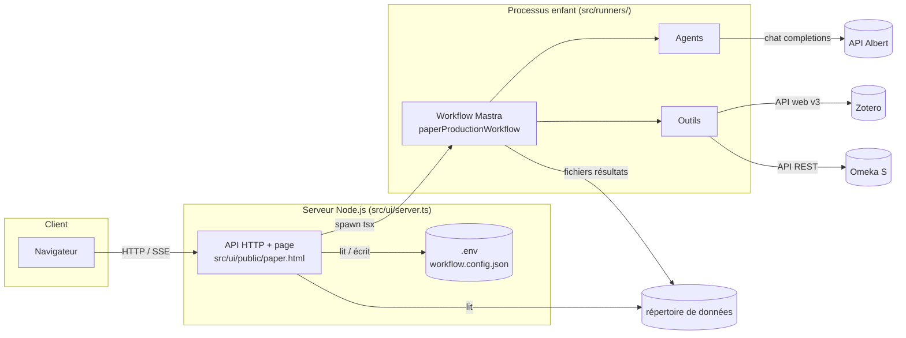
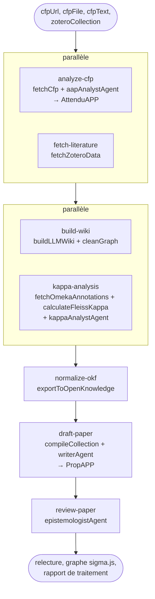
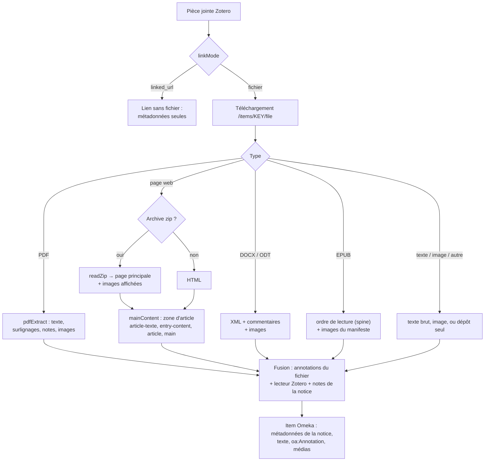
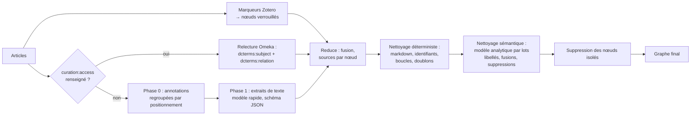
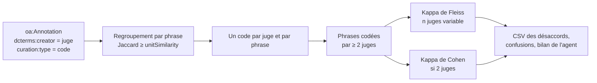
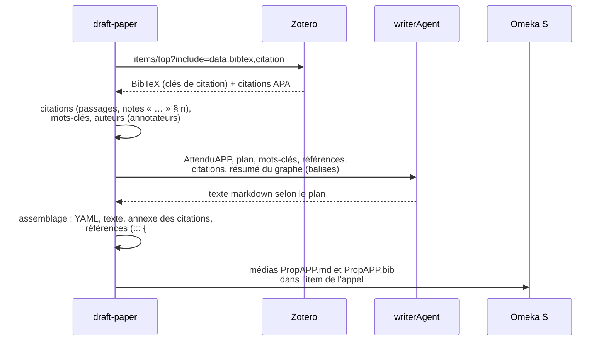
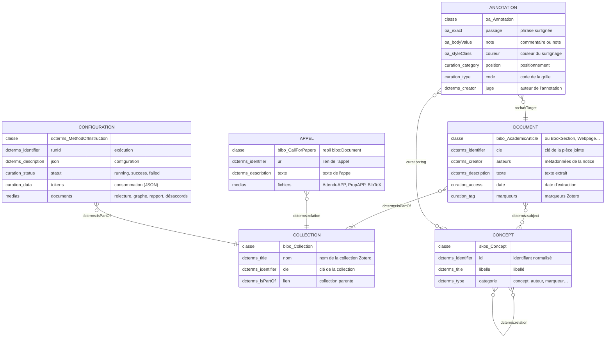
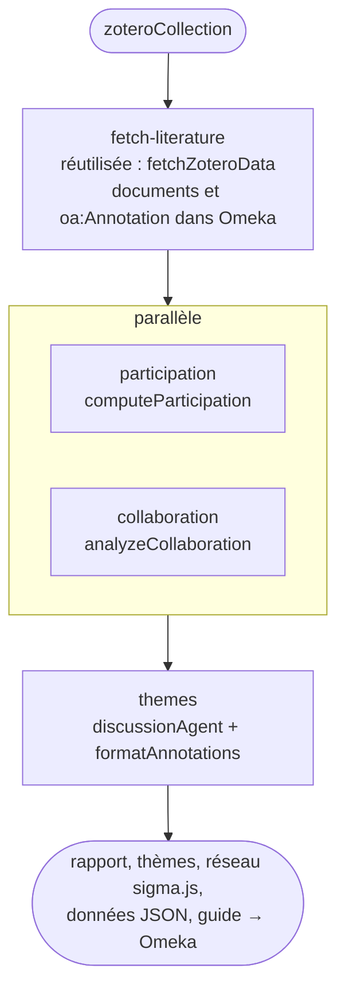

# Documentation technique

Écosystème d'agents IA pour la production d'articles scientifiques (Laboratoire Paragraphe, Université Paris 8). Le projet est écrit en **TypeScript**, exécuté par **tsx** sous **Node.js 22+**, et orchestré par un workflow **Mastra**. Les modèles de langage sont ceux de l'**API Albert** (compatible OpenAI), les sources viennent de **Zotero** et les résultats sont archivés dans **Omeka S**.

## 1. Architecture



- **Interface** (`src/ui/server.ts`) : serveur `node:http` sans dépendance, qui gère `.env` et `workflow.config.json`, lance le workflow dans un **processus enfant** (la configuration et les connexions sont ainsi relues à chaque exécution), diffuse le journal en **Server-Sent Events** et sert les résultats.
- **Lanceurs** (`src/runners/paper.ts`, `src/runners/explo.ts`) : enregistre la configuration dans Omeka S, exécute le workflow Mastra, produit la visualisation du graphe, le rapport de traitement, et importe les documents de fin d'analyse dans l'item de configuration de l'exécution.
- **Répertoire de données** : le répertoire courant. En local c'est la racine du projet ; dans Docker c'est le volume `/data`, le code étant dans `/app`.

## 2. Le workflow



Défini dans `src/workflow/paperProductionWorkflow.ts`, étapes dans `src/workflow/steps/`. Règles de passage des données dans Mastra :

- après un `.parallel([...])`, l'étape suivante reçoit `{ "<id étape>": sortie, ... }` ;
- après un `.then(...)`, elle reçoit directement la sortie de l'étape précédente ;
- `getStepResult("<id>")` donne accès à la sortie de n'importe quelle étape antérieure (utilisé par `draft-paper`).

| Étape | Fichier | Entrées | Sorties principales |
|---|---|---|---|
| `analyze-cfp` | `analyzeCfpStep.ts` | paramètres de l'appel | `cfpAnalysis` (AttenduAPP), `aapItemId`, `aapTitle`, `aapUrl` |
| `fetch-literature` | `fetchLiteratureStep.ts` | `zoteroCollection` | `articles[]`, `collectionItemId` |
| `build-wiki` | `buildWikiStep.ts` | articles, AttenduAPP | `conceptGraph`, `extractedKeys`, `wikiMetadata` |
| `kappa-analysis` | `kappaAnalysisStep.ts` | `collectionItemId` | `kappa`, `confusions`, `summary` |
| `normalize-okf` | `normalizeOkfStep.ts` | graphe, articles | `exportResult` (`omekaIds`, `stats`) |
| `draft-paper` | `draftPaperStep.ts` | graphe + `getStepResult` | `draft` (PropAPP), `proposal` |
| `review-paper` | `reviewPaperStep.ts` | PropAPP, AttenduAPP | `finalReview` |

Les outils sont appelés **directement** par les étapes (`outil.execute({ data })`) : les données brutes circulent entre les étapes sans passer par un modèle. Les agents ne reçoivent que ce qu'ils doivent rédiger ou analyser.

## 3. Organisation du code

```
src/
├── agents/                   agents Mastra, un fichier par agent (index.ts ré-exporte)
├── config/
│   ├── index.ts              configuration de l'Atelier (defaultWorkflowConfig, workflowConfig, outputPath)
│   ├── explo.ts              configuration d'exploZoteroAnno (defaultExploConfig, exploConfig, exploGrid)
│   ├── models.ts             modèles Albert (analytique, rapide)
│   └── store.ts              fusion avec workflow.config.json / explo.config.json
├── lib/                      fonctions et clients utilisés par les outils et les étapes (hors outils Mastra)
│   ├── analysis/             cleanGraph, annotationPositions (grille de couleurs), codebook (grille kappa)
│   ├── extraction/           pdfExtract, attachmentExtract, zip, chunkText
│   ├── metrics/              usage (tokens), impact (énergie, carbone, argent)
│   ├── omeka/                omk (client), oaAnnotations, conceptIndex, conceptStore, zoteroCollections, verify
│   ├── visualization/        graphViz (graphology, sigma.js)
│   └── zotero/               zotero (client), zoteroToOmeka (correspondance des métadonnées)
├── tools/                    outils Mastra uniquement (index.ts ré-exporte)
├── workflow/
│   ├── paperProductionWorkflow.ts   assemblage de l'Atelier d'articles
│   ├── exploWorkflow.ts             assemblage d'exploZoteroAnno
│   ├── steps/
│   │   ├── common/           fetchLiteratureStep (partagée)
│   │   ├── paper/            analyzeCfp, buildWiki, kappaAnalysis, normalizeOkf, draftPaper, reviewPaper
│   │   └── explo/            participation, collaboration, themes
│   ├── reports/              paperReport, exploReport, annotationGuide
│   └── runs/                 saveWorkflowConfig (item Omeka), importSynthesis (médias), history (historique local)
├── runners/                  lanceurs : paper.ts (npm start), explo.ts (npm run explo)
└── ui/
    ├── server.ts             serveur d'une application (npm run ui / npm run ui:explo)
    └── public/               paper.html, explo.html
```

Hors de `src/` : `docs/` (documentation, `grille_annotation.md`), `scripts/build-docs.ts`, `docker/entrypoint.sh`, `install/` (instance Omeka S préparée, distribuée à part). Les fichiers produits vont dans `resultats/atelier/` et `resultats/explo/` (réglages `outputDir`), dans le répertoire de données : la racine du projet en local, le volume `data/` avec Docker.

### Agents (`src/agents/`)

| Agent | Modèle | Rôle |
|---|---|---|
| `aapAnalystAgent` | analytique | analyse des attendus de l'appel (AttenduAPP, markdown) |
| `writerAgent` | analytique | rédaction de PropAPP selon le plan, citations Pandoc |
| `epistemologistAgent` | analytique | relecture critique de PropAPP au regard d'AttenduAPP |
| `kappaAnalystAgent` | analytique | bilan de l'accord inter-juges et recommandations de recalibrage |
| `librarianAgent`, `wikiArchitectAgent`, `ontologistAgent` | rapide / analytique | agents outillés disponibles pour un usage conversationnel |

### Outils (`src/tools/`) et bibliothèques (`src/lib/`)

Les **outils** (`fetchCfp`, `fetchZoteroData`, `buildLLMWiki`, `exportToOpenKnowledge`, `compileCollection`, `fetchOmekaAnnotations`, `calculateFleissKappa`, `computeParticipation`, `analyzeCollaboration`) sont des outils Mastra : appelables par les agents, ils sont exécutés directement par les étapes. Les autres modules sont des bibliothèques de `src/lib/`.

| Module | Rôle |
|---|---|
| `fetchCfp` | télécharge ou lit l'appel (URL ou fichier local), extrait le texte, crée ou met à jour l'item Omeka de l'appel |
| `fetchZoteroData` | parcourt la collection, extrait chaque pièce jointe, fusionne annotations et notes, enregistre documents, annotations et médias dans Omeka |
| `attachmentExtract` | extraction par format : PDF, page web enregistrée (zip), HTML, DOCX, ODT, EPUB, texte, image |
| `pdfExtract` | PDF.js : texte, surlignages (reconstruction par quadPoints), notes, auteur, images (encodage PNG via zlib) |
| `zip` | lecteur ZIP minimal (répertoire central + zlib) |
| `zotero` | client de l'API Zotero v3 : bibliothèque personnelle ou de groupe, pagination, notes, annotations, BibTeX |
| `zoteroToOmeka` | correspondance métadonnées Zotero → dcterms / bibo / curation |
| `zoteroCollections` | items Omeka des collections Zotero (création à la demande, sous-collections) |
| `omk` | client de l'API REST Omeka S (formatage des valeurs, liens, upload de médias) |
| `oaAnnotations` | enregistrement et relecture des `oa:Annotation` |
| `buildLLMWiki` | extraction Map-Reduce des concepts (annotations par positionnement, marqueurs, extraits de texte) |
| `cleanGraph` | nettoyage déterministe puis sémantique (modèle analytique) du graphe |
| `conceptIndex` | recherche d'un concept existant (identifiant ou titre) avant création |
| `conceptStore` | relecture du graphe d'un document déjà extrait |
| `exportToOpenKnowledge` | concepts, relations, liens document → concepts, date d'extraction |
| `annotationPositions` | couleur → positionnement (distance RVB) |
| `codebook` | codes de la grille d'annotation (kappa) |
| `fetchOmekaAnnotations` | annotations codées par juge, regroupées par phrase (similarité de Jaccard) |
| `calculateFleissKappa` | kappa de Fleiss (nombre de juges variable), kappa de Cohen, CSV des désaccords |
| `compileCollection` | références BibTeX, citations, mots-clés, auteurs pour PropAPP |
| `chunkText` | découpage des textes en extraits avec chevauchement |

### Comptage des tokens (`src/lib/metrics/usage.ts`)

Chaque appel à un modèle enregistre sa consommation avec `recordUsage(source, modèle, usage)` : `totalUsage` pour les agents Mastra (appels d'outils compris), `usage` pour `generateObject` du SDK `ai`. Le workflow tourne dans un seul processus : le compteur est partagé par toutes les étapes, et `usageSummary()` fournit le détail par traitement et par modèle au rapport de traitement, à l'item de configuration (`curation:data`, JSON) et à l'historique. Un appel en erreur n'est pas compté.

### Estimation du coût (`src/lib/metrics/impact.ts`)

`estimateImpact(usageSummary())` convertit les tokens de chaque modèle en énergie, carbone et argent, avec les hypothèses de `config.costs` :

- énergie par token (J) = 2 × paramètres actifs × 10⁹ ÷ (`hardware.flopsPerJoule` × `hardware.utilization`) × `hardware.pue` ;
- émissions (g CO₂e) = énergie (kWh) × `carbonIntensity` ; coût de l'électricité = énergie (kWh) × `electricityPrice` ;
- coût équivalent API = tokens d'entrée × `inputPricePerM` + tokens de sortie × `outputPricePerM` (par million) ; un modèle absent de `costs.models` prend les valeurs de `costs.fallback`.

Le résultat alimente la section « Coût du traitement » du rapport, l'item de configuration (`curation:data`, avec les tokens) et l'historique.

### Historique des exécutions (`src/workflow/runs/history.ts`)

À la fin de chaque exécution, `src/runners/paper.ts` ajoute une entrée à `workflow.history.json` (répertoire de données, 500 entrées au plus ; chemin modifiable par `WORKFLOW_HISTORY_FILE`) : identifiant, dates, statut, paramètres d'entrée, appel (titre, item), collection, configuration, titre de la proposition, tokens. L'interface fusionne cet historique avec les items de configuration d'Omeka S (`GET /api/history`) et regroupe les exécutions par appel (lien, fichier ou empreinte du texte).

## 4. Extraction des documents



Clé de fusion des annotations : phrase normalisée, commentaire, auteur et code (deux juges peuvent annoter la même phrase). Les codes de la grille présents dans les marqueurs sont séparés des marqueurs ordinaires (`splitCodes`).

## 5. Graphe de concepts



- Les nœuds **verrouillés** (marqueurs) et **connus** (déjà dans Omeka) ne sont ni renommés ni supprimés par le nettoyage sémantique.
- Chaque nœud garde ses `sources` (clés Zotero des pièces jointes) à travers les fusions : elles servent aux liens `dcterms:subject`.
- Un article n'est marqué extrait (`curation:access`) qu'après une extraction sans erreur et l'export de ses concepts.

## 6. Accord inter-juges



Kappa de Fleiss généralisé : P̄ = moyenne des Pᵢ = (Σⱼ nᵢⱼ² − nᵢ) / (nᵢ(nᵢ − 1)), Pₑ = Σⱼ pⱼ² avec pⱼ = Σᵢ nᵢⱼ / Σᵢ nᵢ. Le calcul est validé sur l'exemple de référence de Fleiss (κ = 0,210) et celui de Cohen (κ = 0,4).

## 7. Proposition d'article (PropAPP)



PropAPP est compatible **Pandoc** : `pandoc PropAPP.md --citeproc -o PropAPP.docx` produit un document avec la bibliographie (le fichier `PropAPP.bib` doit être à côté).

## 8. Modèle de données Omeka S



Les termes utilisés sont paramétrables dans `config.omeka` (`accessTerm`, `subjectTerm`, `relationTerm`, `codeTerm`, `authorTerm`, `conceptClass`, `configClass`, `cfpClass`).

## 9. Configuration

La configuration par défaut est dans `src/config/index.ts` (`defaultWorkflowConfig`). Les modifications faites dans l'interface sont enregistrées dans `workflow.config.json` (seules les différences) et fusionnées au chargement (`configStore.ts`). Les chemins `kappa.codes`, `annotationPositions`, `omeka.vocabs` et `steps` sont remplacés en bloc, les autres objets sont fusionnés clé par clé. Le fichier est désigné par `WORKFLOW_CONFIG_FILE` s'il est défini.

| Clé | Rôle |
|---|---|
| `input.cfpUrl`, `input.cfpFile`, `input.cfpText` | appel à propositions : lien, fichier local, texte ou précisions |
| `input.zoteroCollection` | clé de la collection Zotero |
| `models.provider`, `models.analytics`, `models.fast` | API Albert et modèles |
| `zotero.automaticTags` | inclure les marqueurs automatiques |
| `extraction.chunkSize`, `chunkOverlap`, `maxAnnotationChars` | découpage des textes, taille du bloc d'annotations |
| `tagCategory` | catégorie des concepts issus des marqueurs |
| `annotationPositions`, `annotationColorTolerance` | table couleur → positionnement → consigne |
| `kappa.codes`, `unitSimilarity`, `targetKappa`, `csvPath` | accord inter-juges |
| `proposal.plan`, `authors`, `maxKeywords`, `ignoredTags`, `maxCitations`, `citationStyle` | PropAPP |
| `proposal.expectationsFile`, `proposalFile`, `bibtexFile` | noms des fichiers produits |
| `cleaning.batchSize` | taille des lots de nettoyage sémantique |
| `costs.*` | estimation du coût : devise, prix de l'électricité, intensité carbone, matériel (rendement, utilisation, PUE), paramètres actifs et tarifs de référence par modèle |
| `omeka.*` | vocabulaires, classes et propriétés |

## 10. API de l'interface

| Méthode et route | Rôle |
|---|---|
| `GET /` | page de l'interface |
| `GET /api/settings` | variables `.env` (secrets masqués), configuration effective et par défaut |
| `POST /api/settings` | enregistre `.env` (un secret vide est conservé) et `workflow.config.json` |
| `POST /api/check` | teste Albert, Zotero et Omeka S (vocabulaires) |
| `GET /api/zotero/collections` | collections de la bibliothèque |
| `GET /api/albert/models` | modèles disponibles |
| `POST /api/cfp-file?name=` | importe le fichier de l'appel dans `aap/` |
| `POST /api/run`, `POST /api/run/stop`, `GET /api/run` | lancer, arrêter, état |
| `GET /api/run/events` | journal et statut en Server-Sent Events |
| `GET /api/results`, `GET /api/file?name=` | liste et contenu des résultats (liste blanche) |
| `GET /api/history` | appels traités : historique local et configurations Omeka S, regroupés par appel |
| `GET /docs/…` | documentation HTML |

Le serveur écoute sur `127.0.0.1` (variable `HOST` pour le conteneur) et le port `PORT` (7272).

## 11. Étendre le projet

**Ajouter un outil** : créer `src/tools/monOutil.ts` sur le modèle des outils existants (`new Tool({ name, description, schema, execute: async ({ data }) => … })`, schéma zod typé avec `z.infer`), puis l'exporter dans `src/tools/index.ts`.

**Ajouter une étape** : créer `src/workflow/steps/paper/monEtape.ts` (ou `explo/`, `common/`) avec `createStep({ id, execute })`, l'insérer dans `paperProductionWorkflow.ts`, ajouter son identifiant à `config.steps` et son libellé dans `processingReport.ts`.

**Ajouter un paramètre** : l'ajouter à `defaultWorkflowConfig` ; il apparaît automatiquement dans l'interface (ajouter un libellé dans `LABELS`, et la section dans `SECTIONS`, de `paper.html`).

## 12. Workflow exploZoteroAnno

Second workflow (`src/workflow/exploWorkflow.ts`, étapes dans `src/workflow/steps/explo/`), consacré à l'annotation collective d'une collection Zotero. Il a sa propre configuration (`defaultExploConfig` dans `src/config/explo.ts`, surcharges dans `explo.config.json`), sa page (`src/ui/public/explo.html`) et **son propre serveur** (voir *Un serveur par application*).



| Élément | Rôle | Réutilise |
|---|---|---|
| `fetch-literature` | collection, annotations (auteur, couleur, date), notes, Omeka | étape et outil de l'Atelier d'articles |
| `computeParticipation` | par collaborateur, document, couleur de la grille, semaine | `positionForColor` avec la grille de l'exploration |
| `analyzeCollaboration` | passages communs, paires, convergences et divergences, kappa, réseau | `words` / `jaccard`, `fleissKappa` / `cohenKappa`, `interpretKappa` |
| `discussionAgent` | thèmes de discussion (modèle analytique) | `formatAnnotations` (grille en paramètre), comptage des tokens |
| `src/runners/explo.ts` | lancement (`npm run explo`), fichiers, Omeka, coût | `saveWorkflowConfig`, `updateWorkflowStatus`, `attachDocuments`, `generateGraphHtml`, `usageReport`, `estimateImpact` |
| `src/workflow/reports/annotationGuide.ts` | guide d'annotation à partir de la grille | — |

Fichiers produits dans `resultats/explo/` (réglage `outputDir`) : `guide_annotation.md`, `participation.json`, `collaborations.json`, `reseau_collaborations.html`, `themes_discussion.md`, `rapport_explo.md`.

Pour permettre ce suivi, deux évolutions profitent aux deux workflows : la date des annotations et des notes Zotero est conservée (`dcterms:created` sur l'`oa:Annotation`), et les nouvelles annotations du lecteur Zotero sont synchronisées pour les documents déjà présents dans Omeka S. Les briques communes acceptent désormais un paramètre : grille de couleurs (`positionForColor`, `formatAnnotations`), fichier de configuration (`readConfigOverride`, `writeConfigOverride`), fichier d'historique (`appendHistory`), workflow décrit (`saveWorkflowConfig`).

API propre au serveur exploZoteroAnno : `GET` et `POST /api/explo/settings`, `POST /api/explo/guide`, `GET /api/explo/results`, `GET /api/explo/file?name=`.

### Un serveur par application

`src/ui/server.ts` sert **une** application, choisie en argument (`tsx src/ui/server.ts explo`) ou par `WORKFLOW_APP` (`paper` par défaut). Chaque serveur a son paramétrage :

| | Atelier d'articles (`paper`) | exploZoteroAnno (`explo`) |
|---|---|---|
| Lancement | `npm run ui` | `npm run ui:explo` |
| Port / adresse d'écoute | `PORT` (7272) / `HOST` | `EXPLO_PORT` (7273) / `EXPLO_HOST` (ou `HOST`) |
| Connexions | `.env` | `.env` surchargé par `.env.explo` (`EXPLO_ENV_FILE`) |
| Configuration | `workflow.config.json` | `explo.config.json` |
| Workflow lancé | `src/runners/paper.ts` | `src/runners/explo.ts` |
| Page | `paper.html` | `explo.html` |

Chaque serveur a son propre traitement en cours (les deux applications peuvent traiter simultanément) et son propre flux de journal. Routes communes : `/api/settings` (connexions et configuration de l'application du serveur ; un secret vide est conservé, une valeur identique à la valeur héritée n'est pas recopiée dans `.env.explo`), `/api/check`, `/api/zotero/collections`, `/api/albert/models`, `/api/run*`, `/docs/`, et `GET /api/apps` (adresses des deux applications, `PAPER_URL` / `EXPLO_URL` ou port local, pour les liens entre elles). Les routes propres à l'autre application répondent 404 ; l'ancienne adresse `/explo` de l'Atelier redirige vers le serveur d'exploZoteroAnno.

## 13. Documentation et conteneur

- `npm run docs` convertit `docs/*.md` en `docs/html/*.html` (script `scripts/build-docs.ts`, bibliothèque **marked** ; les diagrammes **Mermaid** sont rendus dans le navigateur).
- `Dockerfile` : image `node:22-bookworm-slim`, code dans `/app`, données dans le volume `/data`, commandes `workflow-ui` (serveur de l'application `WORKFLOW_APP`), `workflow` et `workflow-explo` (lignes de commande).
- `docker-compose.yml` : deux services à partir de la même image, `workflow` (Atelier, 7272) et `explo` (exploZoteroAnno, 7273), publiés sur `127.0.0.1` et partageant `./data`.
- `docker/entrypoint.sh` : le conteneur démarre en root, rétablit si besoin la propriété de `/data` pour l'utilisateur `node` (uid 1000), puis exécute la commande sous `node` avec `setpriv`. Les commandes `workflow` et `workflow-ui` lancées par `docker compose exec` (en root) passent aussi par ce point d'entrée.
- `docker-compose.yml` : port publié sur `127.0.0.1:7272`, volume `./data:/data`, `host.docker.internal` pour un Omeka S local.

## 14. Limites connues

- `tsc --noEmit` signale des erreurs de typage liées à la configuration TypeScript (CommonJS avec `verbatimModuleSyntax`) et aux types Mastra (étapes sans schéma) ; l'exécution par tsx n'est pas affectée.
- La reconstruction des passages surlignés d'un PDF est une approximation proportionnelle à la largeur des blocs de texte.
- Les sites protégés contre les robots ne peuvent pas être téléchargés : utiliser un fichier local.
- Le contexte des modèles limite la taille des textes transmis (appel très long, plan très détaillé).
