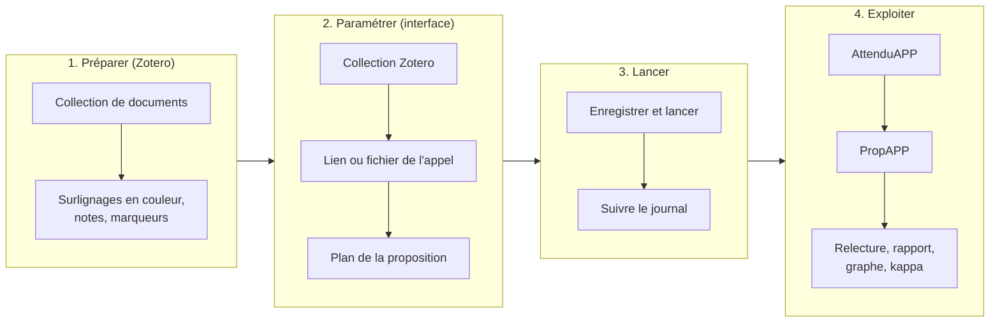
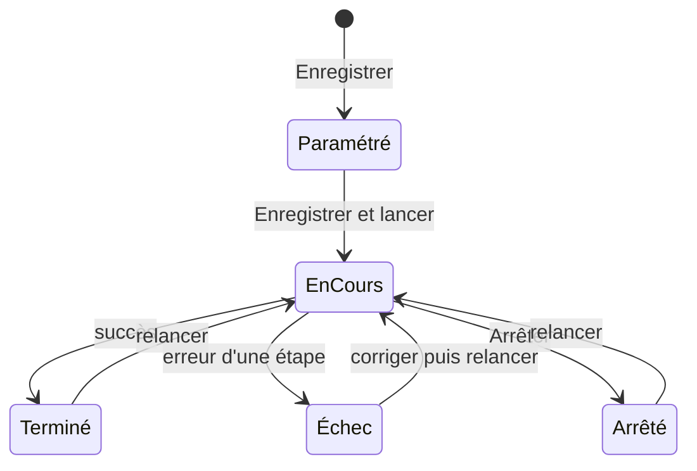
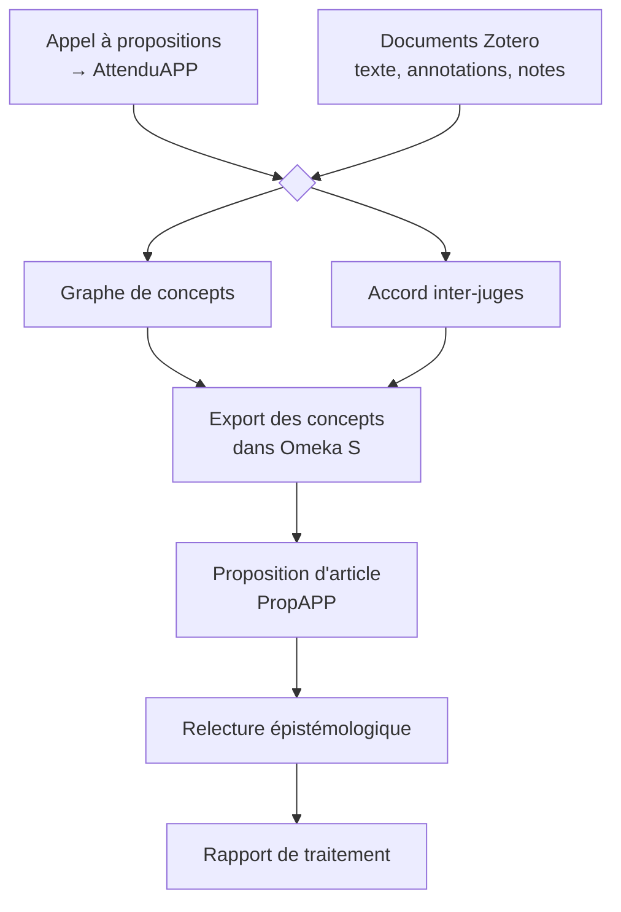
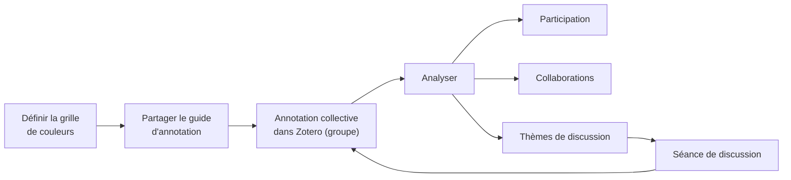
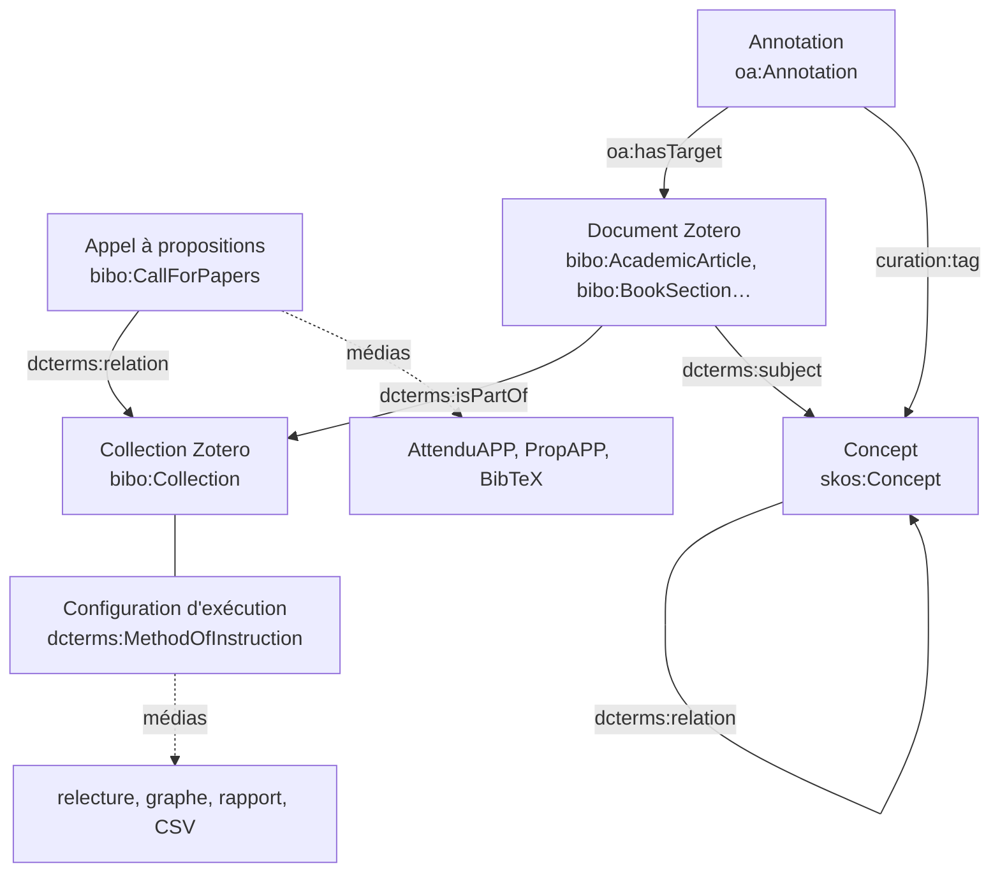

# Documentation utilisateur

L'écosystème d'agents aide à **répondre à un appel à propositions (AAP)** à partir d'une **collection Zotero** annotée. Il analyse les attendus de l'appel, extrait les concepts de la collection, mesure l'accord entre annotateurs, puis rédige une **proposition d'article** avec références, citations et mots-clés. Tout est archivé dans **Omeka S**.



## 1. Préparer le corpus dans Zotero

### La collection

Rassembler dans une collection Zotero les documents à mobiliser : articles, chapitres, pages web enregistrées, PDF, DOCX, ODT, EPUB, textes. Chaque **notice** Zotero fournit la référence bibliographique (BibTeX) de la proposition ; ses **pièces jointes** fournissent le texte analysé.

### Surligner avec une couleur qui indique votre positionnement

La couleur d'un surlignage indique votre position par rapport au passage. Elle oriente l'extraction des concepts et apparaît dans les citations de la proposition. La table par défaut reprend la palette de Zotero ; elle est modifiable dans **Paramètres › Positionnement par couleur**.

| Couleur | Positionnement | Effet sur l'extraction |
|---|---|---|
| 🟨 jaune | Idée clé | concepts centraux, reliés entre eux |
| 🟩 vert | Accord | idées reprises : relations « soutient », « fonde », « prolonge » |
| 🟥 rouge | Désaccord | thèses contestées : relations « s'oppose à », « critique » |
| 🟦 bleu | Définition | concept défini et ses composantes |
| 🟪 violet | Méthode | méthodes et protocoles |
| 🟣 magenta | Question ouverte | questions à approfondir |
| 🟧 orange | Exemple | exemples, cas, terrains |
| ⬜ gris | Contexte | éléments secondaires |

Les annotations faites dans le lecteur Zotero et celles déjà présentes dans un PDF sont toutes les deux prises en compte.

### Notes et marqueurs

- Une **note** rattachée à une notice est traitée comme une annotation : c'est typiquement une citation (« … » § 15) accompagnée de votre commentaire. Le repère (§ 15, p. 12) est repris dans la citation.
- Un **marqueur** (tag) sur une notice, une pièce jointe, une note ou une annotation devient un **concept** : il apparaît dans le graphe, dans les mots-clés de la proposition et dans Omeka S. Les marqueurs listés dans *Marqueurs exclus des mots-clés* (par défaut `citation`) ne deviennent pas des mots-clés.

### Coder les phrases pour l'accord inter-juges

Pour mesurer l'accord entre plusieurs annotateurs (juges), chaque juge ajoute **comme marqueur** le code de la grille d'annotation (`grille_annotation.md`) sur la phrase annotée :

| Code | Positionnement argumentatif |
|---|---|
| `ACC-S`, `ACC-E`, `ACC-C` | Accord – assentiment, expansion, concession |
| `DES-F`, `DES-A` | Désaccord – factuel/logique, absurde |
| `NEU-S`, `NEU-R` | Neutralité – suspension, relativisation |
| `RHET-H`, `RHET-E` | Rhétorique – ad hominem, épouvantail |
| `DEP-S` | Dépassement – synthèse |
| `AMB` | Ambigu |

Les juges doivent travailler dans une **bibliothèque de groupe** Zotero : c'est ce qui permet de savoir qui a codé quoi. Les codes ne deviennent pas des concepts.

## 2. Utiliser l'interface

L'interface s'ouvre sur http://127.0.0.1:7272. Elle comporte quatre onglets : Paramètres, Exécution, Résultats et Appels traités.

### Paramètres

| Section | Contenu |
|---|---|
| Connexions | accès à Albert, Zotero et Omeka S (fichier `.env`). Les secrets ne sont jamais réaffichés : laisser le champ vide pour garder la valeur enregistrée. Le bouton **Tester les connexions** vérifie les trois services. |
| Données d'entrée | collection Zotero (liste déroulante), **lien vers l'appel**, **fichier de l'appel** (si le site bloque le téléchargement), texte ou précisions sur l'appel |
| Proposition d'article | **plan en markdown**, auteurs supplémentaires, nombre de mots-clés et de citations, style de citation |
| Modèles de langage | modèles Albert (suggestions chargées depuis l'API) |
| Extraction sémantique | taille des extraits de texte, lots de nettoyage |
| Zotero et marqueurs | marqueurs automatiques, catégorie des concepts issus des marqueurs |
| Positionnement par couleur | table couleur → positionnement → consigne pour le modèle |
| Accord inter-juges | codes de la grille, similarité de phrase, kappa requis |
| Omeka S (avancé) | vocabulaires, classes et propriétés utilisées |

**Enregistrer** écrit les modifications dans `.env` et `workflow.config.json` ; **Rétablir la configuration par défaut** revient aux valeurs de `config.ts`.

#### Le plan de la proposition

Le plan est un texte markdown : chaque titre devient une section de la proposition, les lignes `Consigne :` guident le rédacteur et ne figurent pas dans le texte final.

```markdown
# Titre de la proposition
Consigne : titre court et explicite, en lien direct avec l'appel.

## Résumé
Consigne : 250 mots maximum ; problématique, démarche, apports attendus.

## Cadre théorique
Consigne : mobiliser les concepts du graphe et les références de la collection, avec citations.
```

#### Quand le site de l'appel bloque le téléchargement

Certains sites (par exemple ceux protégés par Cloudflare) refusent les accès automatiques. Ouvrir la page dans le navigateur, l'enregistrer en PDF (*Imprimer › Enregistrer au format PDF*) ou en HTML, puis l'importer avec **Fichier de l'appel**. Le lien reste la source de l'appel dans Omeka S.

### Exécution

**Enregistrer et lancer** enregistre les paramètres et démarre le traitement. Le journal s'affiche en direct ; un traitement peut être **arrêté**. On peut fermer la page : le journal reprend à la réouverture.



Le traitement enchaîne les étapes suivantes (durée indicative : quelques minutes par document, selon la taille des textes) :



Un document dont l'extraction sémantique est déjà faite (date `curation:access` renseignée dans Omeka S) n'est pas retraité : ses concepts sont relus dans Omeka S. Relancer est donc rapide quand seuls quelques documents ont changé.

### Résultats

L'onglet **Résultats** affiche les documents produits : markdown mis en forme, tableaux CSV, graphe interactif.

| Document | Contenu | Emplacement dans Omeka S |
|---|---|---|
| **PropAPP** | proposition d'article : métadonnées (titre, auteurs, mots-clés), texte selon le plan, annexe des citations, références BibTeX | item de l'appel |
| **AttenduAPP** | analyse des attendus de l'appel : problématique, axes, contraintes formelles, critères, calendrier | item de l'appel |
| Références BibTeX | `PropAPP.bib`, notices de la collection | item de l'appel |
| Relecture épistémologique | critique de PropAPP au regard d'AttenduAPP | item de configuration de l'exécution |
| Graphe de concepts | visualisation interactive sigma.js (les données graphology JSON restent en local) | item de configuration de l'exécution |
| Désaccords entre juges | CSV des phrases codées, désaccords en tête | item de configuration de l'exécution |
| Rapport de traitement | étapes, documents traités, graphe, accord inter-juges, appel et proposition, **tokens consommés, coût estimé (énergie, carbone, argent)** | item de configuration de l'exécution |

#### Le graphe de concepts

La taille d'un concept dépend de son nombre de relations, sa couleur de sa catégorie. **Survoler** un concept met en évidence ses voisins ; **cliquer** ouvre sa fiche (relations, documents sources, lien vers l'item Omeka S). La recherche, la légende (pour masquer une catégorie) et le zoom sont dans le panneau.

#### Les auteurs de la proposition

Les **annotateurs Zotero** sont auteurs de la proposition (par nombre d'annotations décroissant), suivis des *auteurs supplémentaires* saisis dans les paramètres.

#### Lire l'accord inter-juges

| Kappa | Interprétation (Landis et Koch) |
|---|---|
| ≤ 0 | aucun accord |
| 0,01 – 0,20 | léger |
| 0,21 – 0,40 | passable |
| 0,41 – 0,60 | modéré |
| 0,61 – 0,80 | **substantiel** : seuil de validation du corpus |
| > 0,80 | presque parfait |

Le kappa de Fleiss est calculé pour trois juges ou plus, et le kappa de Cohen s'y ajoute avec deux juges. Le rapport liste les codes les plus souvent confondus et un bilan rédigé par l'agent analyste ; le CSV détaille chaque phrase pour un recalibrage ciblé.

#### La consommation de tokens

Le rapport de traitement indique le nombre de tokens consommés par les modèles : total, entrée, sortie (et raisonnement), détaillé par traitement (attendus de l'appel, extraction, nettoyage du graphe, rédaction, relecture, bilan kappa) et par modèle. Le total est aussi enregistré dans l'item de configuration de l'exécution (`curation:data`) et affiché dans l'onglet *Appels traités*.

#### Le coût du traitement

Le rapport estime aussi le **coût du traitement** : énergie consommée (Wh), émissions de gaz à effet de serre (g CO₂e), coût de l'électricité et **coût équivalent API** (ce qu'aurait coûté le même volume de tokens aux tarifs du marché ; l'API Albert étant mise à disposition par l'État, ce n'est pas un montant facturé), détaillés par modèle, avec des ordres de grandeur (ampoule LED, recharge de smartphone).

Il s'agit d'une **estimation**, pas d'une mesure : l'énergie par token est déduite de la taille du modèle (paramètres actifs), du rendement des processeurs graphiques, de leur taux d'utilisation et du PUE du centre de données. Toutes ces hypothèses, l'intensité carbone de l'électricité et les tarifs de référence sont modifiables dans **Paramètres › Coût du traitement** et rappelées en bas de la section du rapport. La fabrication du matériel, le réseau et les postes de travail ne sont pas comptés.

L'estimation est aussi enregistrée dans l'item de configuration de l'exécution (`curation:data`) et affichée dans l'onglet *Appels traités*.

### Appels traités

L'onglet **Appels traités** liste les appels à propositions déjà analysés, avec l'historique de leurs exécutions (date, collection, statut, durée, tokens, coût estimé, titre de la proposition, lien vers la configuration dans Omeka S). Il réunit l'historique local (`workflow.history.json`) et les configurations enregistrées dans Omeka S : les exécutions faites depuis une autre machine ou avant une réinstallation y figurent aussi.

Pour chaque appel :

- **Rejouer** relance l'analyse avec la collection choisie (par défaut, la dernière utilisée), **avec les paramètres et les connexions actuels** : c'est l'usage prévu après une modification de la collection Zotero (nouveaux documents, annotations, notes), un changement de modèle ou de connexion ;
- **Charger dans les paramètres** reprend l'appel et la collection dans l'onglet Paramètres, pour les ajuster avant de lancer.

Seuls les documents nouveaux ou modifiés sont retraités : ceux dont l'extraction est déjà faite sont relus dans Omeka S. Un appel importé depuis un fichier local ne peut être rejoué que si le fichier est toujours présent dans `aap/`.

## 3. exploZoteroAnno : animer une annotation collective

**exploZoteroAnno** est une seconde application, avec son propre serveur : http://127.0.0.1:7273 (lien dans l'en-tête de l'Atelier d'articles). Elle a ses propres connexions (onglet Grille, héritées de celles de l'Atelier sauf modification) et peut analyser pendant qu'un traitement de l'Atelier est en cours. Elle accompagne un groupe qui annote ensemble une collection Zotero : elle fixe une grille de couleurs commune, mesure la participation de chacun, analyse les convergences et divergences de lecture, et propose des thèmes pour une séance de discussion. Tout est enregistré dans Omeka S.



### Paramétrer la grille (onglet Grille)

- **Collection** : la collection Zotero annotée, idéalement dans une **bibliothèque de groupe** pour que chaque annotation garde son auteur. Les connexions sont celles de l'Atelier d'articles.
- **Grille de couleurs** : pour chaque couleur de surlignage de Zotero, une signification (idée clé, accord, désaccord, définition, méthode, question, exemple, contexte par défaut) et une consigne « quand l'utiliser ». La grille se modifie librement (couleurs, libellés, ajout ou suppression).
- **Guide d'annotation** : produit à partir de la grille, avec les consignes d'annotation (bibliothèque de groupe, commentaires, notes, marqueurs). Il se copie ou se télécharge pour être envoyé aux collaborateurs, et il est enregistré dans Omeka S à chaque analyse.
- **Analyse** : similarité à partir de laquelle deux surlignages portent sur le même passage, nombre minimum de passages communs pour calculer un kappa, nombre de thèmes de discussion.

**Enregistrer et analyser** lance le workflow ; il peut être relancé à tout moment pendant l'annotation : les nouvelles annotations de Zotero sont prises en compte.

### Visualiser la participation (onglet Participation)

- chiffres clés : collaborateurs, surlignages, notes, documents annotés, couleurs hors grille ;
- une barre par collaborateur, découpée selon la signification des couleurs (et les notes) ;
- la chronologie des annotations par semaine et par collaborateur ;
- le détail par personne (commentaires, mots surlignés, documents, part de l'effort, jours actifs, première et dernière annotation) ;
- la couverture de la collection : qui a annoté quel document, et les documents encore sans annotation.

### Analyser les collaborations (onglet Collaborations)

- **passages en commun** : deux surlignages d'un même document sont rapprochés quand leurs mots se recouvrent suffisamment ;
- **convergence** (même signification) et **divergence** (significations différentes) de lecture sur ces passages ;
- **matrice** des passages en commun et de l'accord pour chaque paire de collaborateurs ;
- **kappa** d'accord sur la signification des couleurs, calculé à partir d'un nombre minimum de passages communs ;
- les **passages aux lectures divergentes**, avec la lecture et le commentaire de chacun ;
- le **réseau** collaborateurs–documents (sigma.js), où les liens entre collaborateurs indiquent leurs passages communs et leur accord.

### Générer des thèmes de discussion (onglet Thèmes)

Un agent propose des thèmes pour une séance collective à partir des passages divergents et convergents, des commentaires, des notes et des marqueurs : pour chaque thème, une question ouverte, la raison du choix, les passages à relire (avec les personnes concernées) et une piste d'animation. Il veille à impliquer aussi les participants les moins actifs.

### Rapport et enregistrement (onglet Rapport)

Le rapport reprend participation, collaborations et thèmes, ainsi que les tokens consommés et le coût estimé. Chaque analyse crée dans Omeka S un item « Configuration explo-zotero-anno » (classe `dcterms:MethodOfInstruction`) avec la grille et les paramètres, son statut, sa consommation et, en médias : guide d'annotation, rapport, thèmes, réseau, données de participation et de collaborations. Les documents et annotations de la collection sont enregistrés comme dans l'Atelier d'articles (`oa:Annotation` avec auteur, couleur, date).

## 4. Ce qui est enregistré dans Omeka S



- Chaque **document** porte les métadonnées de sa notice Zotero (auteurs, date, revue, DOI…), son texte, ses fichiers et images, et la date de sa dernière extraction (`curation:access`).
- Chaque **annotation** porte le passage, votre commentaire, la couleur et le positionnement, les marqueurs (liés aux concepts), le code de la grille et son auteur.
- Un **concept** n'est jamais créé en double : avant de le créer, le workflow cherche un concept de même identifiant ou de même titre.
- Chaque **exécution** enregistre sa configuration (sans les clés d'API), son statut, les tokens consommés et, en médias, ses documents de fin d'analyse (relecture, graphe, rapport, désaccords).

## 5. Questions fréquentes

**Puis-je modifier le plan de la proposition ?** Oui, dans *Paramètres › Proposition d'article › Plan de la proposition*. Les titres et leur ordre sont respectés par le rédacteur.

**Pourquoi un document n'est-il pas retraité ?** Son extraction est déjà faite (`curation:access`). Pour la relancer, vider cette propriété sur l'item du document dans Omeka S.

**Une nouvelle note Zotero est-elle prise en compte ?** Oui : elle est ajoutée aux annotations du document dans Omeka S, et ses marqueurs deviennent des concepts, sans relancer l'extraction du document.

**Le rédacteur peut-il inventer des références ?** Il ne reçoit que les clés BibTeX de la collection et doit citer uniquement celles-ci (syntaxe Pandoc `[@clé, p. 12]`) ; la relecture épistémologique vérifie l'usage des références.
