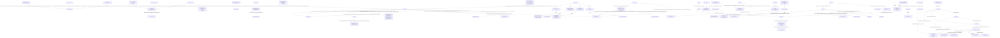

```mermaid
graph TD

    %% Définition des nœuds
    unread["/unread"]
    citation["citation"]
    frontiere["frontière"]
    topologie["topologie"]
    affordance["affordance"]
    environnement["environnement"]
    ecosysteme["écosystème"]
    10["Alignement de fractales / frontière d'objet fractal"]
    12bis["Ré‑édition d’un acte dans un acte"]
    13["Réseau de métaphores abstraites vs. réseau concret"]
    2["Frontière (Boundary)"]
    3_a["Relation HFC → environnement"]
    3_b["Mise à jour des propriétés"]
    3_d["Composition vs. système"]
    4["Espace des réseaux"]
    5["Frontière comme zone ouverte ou comme interface"]
    6["Imbrication des temporalités (réseau machine / temps humain)"]
    7["Limite et bordure"]
    9["Réorganisation (fragments / networking) via la fonction, lieu de la classification"]
    affordance_agents["Affordances subjectives – relations dynamiques entre un agent (biologique ou humain) et un objet ou un environnement, selon les capacités motrices et les finalités de l’individu"]
    affordance_dynamique["Affordances dynamiques – création, modification ou suppression interactives par le sujet ou des agents antérieurs"]
    affordance_paradigmes["Patterns d’affordances organisés selon les cadres de Gibson (1979, 1987)"]
    agentivite_relationnelle["Agentivité relationnelle"]
    artefact["Artefact : ensemble technique structuré modulant les affordances sociales"]
    cast_actants["Ensemble des actants"]
    ch_impietement["« Empiétement » / « zone d’empiétement »"]
    cnx_donto_ethique["Onto‑éthique"]
    cnx_hn_gm_resfoundation["Refondation théorique et opérationnelle des Humanités Numériques"]
    cnx_humains_chercheurs["Les chercheurs humains"]
    concept_cycle_semiose["Cycle de sémiose (rouage ralentisseur des concepts et métaphores physiques)"]
    concept_dimension_existente["Dimensions de l’ontologie existentielle (sociale, temporelle, matérielle)"]
    concept_dynamique_couplage["Couplage immanent des dimensions"]
    concept_exist_ments_info["Existences informationnelles"]
    concept_onto_ethique["Onto‑éthique"]
    concept_res_eure_humain["Chercheurs humains (enjeux / ontologie et éthique)"]
    concept_spirale_conique_pappus["Spirale conique de Pappus"]
    echelle_representation["Échelle de représentation"]
    ecosystem_modelise["Écosystème de connaissances et ses interfaces mécaniques"]
    ecosysteme_environnemental["Écosystème environnemental (couplage sujet‑environnement / écologie de l’action)"]
    ecosysteme_socio_educationnel["Écosystème socio‑éducatif"]
    empietement["Empiétement"]
    entre_theme_conceptuelle_singuliere["Entre « On / Nous » parmi l’entre (singulier / pluriel)"]
    environnement_unread["Environnement (réel + symbolique)"]
    frontiere_f_1["Frontière"]
    g_1["Réticularité généralisée"]
    g_21["Lutte (empiètement territorial, milieu politique, contenu)"]
    g_7["Théorie de la Grande Unification (TGGU)"]
    imbrication_temps["Imbrication des temps (puissance temporelle, récursivité chrono‑superposée)"]
    ligne_de_fuite["Ligne de fuite"]
    luttes_frontieres["Dynamique des luttes aux confins"]
    miserelation["Mise en relation (sujet‑artefact)"]
    n_1["Onto‑éthique"]
    n_2["Existences informationnelles [Quach et al. 2022]"]
    n_3["Agent IA conversationnel incarné [Pappa et al. 2023]"]
    neu_affordance["Affordance"]
    neu_ecosysteme["Écosystème"]
    neu_environnement["Environnement"]
    neu_unread["Dates principales / indexation directe"]
    node_solaris["Solaris"]
    objet_fractal["Objet fractal"]
    onto_ethique["Onto‑éthique (adaptation du terme de Bootz/Salzeda)"]
    ontologie_spinoza_deleuze["Ontologie spinoziste‑formalisée (Sallantin 2009 ; Deleuze 1968)"]
    orientation_but["Orientation vers un but (imposé ou singulier)"]
    post_linearite["Post‑linéarité (suite aux ruptures industrielles)"]
    principe_symetrie_generalissee["Principe de symétrie généralisée (192?, 442?, Ziku et al. 2023)"]
    proliferation_objets_heterogene["Prolifération d’objets hétérogènes"]
    rapport_v_environnement["Rapport sujet / environnement"]
    refondation_theorique_et_operationnelle_hn["Refondation théorique et opérationnelle des humanités numériques (HN)"]
    relation_interactive["Relation d’interaction (agir sur autrui)"]
    relation_sujet_artefact["Relation sujet‑artefact"]
    relativite_topologique["Relativité topologique"]
    reseau["Principe du réseau"]
    reseau_p_limites["Limites du réseau"]
    territoire_dynamique_memories["Milieu de pensée orthogonal"]
    theorie_agents["Théorie des agents"]
    topologie_0["Topologie"]
    tranche_frontieres["Déplacements du tracé de frontière"]
    transformation_des_proprietes_envir["Transformation des propriétés de l’environnement par interaction"]
    video_rythmique_apprentissage["Appétit d’évolution temporelle des connaissances et rythmes d’apprentissage"]
    zotero_ic_notation["Note du chercheur (dans un repli sans couleur)"]

    %% Définition des relations
    frontiere -->|"caractere_central_de_la_frontiere_la_zone_resultant_de_sa_porosite"| empietement
    frontiere -->|"la_frontiere_fonctionne_comme_un_objet_fractal_selon_son_degre_indetermine"| objet_fractal
    topologie -->|"la_topologie_se_fait_relative_a_l_echelle_du_vecteur_spatial_analyse"| relativite_topologique
    frontiere -->|"sa_definition_varie_en_fonction_de_l_echelle_de_representation_adoptee"| echelle_representation
    frontiere -->|"le_trace_fondamental_est_constamment_remanie_par_des_tensions_internes"| luttes_frontieres
    topologie -->|"topologie_determine_les_possibilites_d_empietement_perio_aeriel"| frontiere
    frontiere -->|"destabilisation_opinionnelle_conflicts_projectent_des_lignes_limitrophes_fluctuantes"| tranche_frontieres
    citation -->|"reference_citatique_a_une_topologie_fictionnelle"| node_solaris
    node_solaris -->|"illustration_fficfictionnelle_de_l_empietement"| ch_impietement
    proliferation_objets_heterogene -->|"consecutivite_d_une_topologie_de_co_evolution"| topologie_0
    topologie_0 -->|"informels_solutions_logiques_de_couplage_thopes_temporels"| imbrication_temps
    node_solaris -->|"fusion_des_flux_dans_une_paradoxale_ontologie_intrarelatiale"| topologie_0
    imbrication_temps -->|"postlinearite_altecunente_reflexive_eflexivites_technologiques_neo"| post_linearite
    reseau -->|"non_developpement_causale"| reseau_p_limites
    frontiere_f_1 -->|"l_extension_d_un_empietement_multidimensionnel_a_la_borderline_elle_meme_arene_des_conflits_strategies_orientales"| g_21
    frontiere_f_1 -->|"relocalisation_des_luttes_dans_l_ontologie_empietement_like_recursif_ou_meme_haftur"| g_21
    g_7 -->|"concept_suppose_theorie_fuga_enceprtee_dans_une_tggu"| g_1
    zotero_ic_notation -->|"integration"| orientation_but
    zotero_ic_notation -->|"integre_notion_processus"| rapport_v_environnement
    zotero_ic_notation -->|"detaille"| relation_interactive
    zotero_ic_notation -->|"citait_selon_haeckel_et_mobius_sans_autor_decouvrir"| neu_affordance
    zotero_ic_notation -->|"reviser_perspective_affordance"| neu_environnement
    zotero_ic_notation -->|"relier_aux_perpectives_fenomenologique_et_communicationnelle"| transformation_des_proprietes_envir
    zotero_ic_notation -->|"transforme_dans_son_rapport_a_soi"| entre_theme_conceptuelle_singuliere
    transformation_des_proprietes_envir -->|"formulation_particulier_la_dimension_ecologique"| neu_affordance
    orientation_but -->|"selon_configuration_devenue_partie_du_systeme"| neu_ecosysteme
    neu_unread -->|"link_haeckel_1879"| neu_affordance
    neu_ecosysteme -->|"est_environnement_deroule_atteue"| neu_environnement
    neu_environnement -->|"supports_ces_process_points_utopique"| neu_affordance
    neu_affordance -->|"or_lies_realite_silage_utilite"| neu_ecosysteme
    transformation_des_proprietes_envir -->|"metaphysiquement_penser_plus_un_apprentissage_associatif"| neu_environnement
    neu_environnement -->|"qualifie_et_change_branche_ecologique"| zotero_ic_notation
    environnement -->|"constitue_la_surface_de_l_affordance_dans_laquelle_peuvent_emerger_des_relations_sujet_artefact_de_perception_ou_interdites_selon_composants"| affordance
    affordance -->|"c_est_cette_approche_qui_permet_d_identifier_les_raisons_et_conditions_de_mise_en_relation_affordance_et_de_transformer_ou_non_les_proprietes"| relation_sujet_artefact
    affordance -->|"opere_par_l_selection_simple_ou_partie_toute_ressource_objetide_la_docuvoire_anmes_tuine_lauk_il_oplicantect"| miserelation
    environnement -->|"lefeature_en_centre_des_propretve_emergente_et_limitante_environnementales_sur_l_action_corencee"| affordance
    affordance -->|"constitue_sur_la_base_de_qualife_nais_tuning_de_reaespoalmetenpourart_compte_out_du_foriment_contelopardance_en_collect_tant_ce_qu_une_vara_un"| relation_sujet_artefact
    affordance -->|"depend_des_proprietes_contextualisees_evalues_ecosentr_tf_izione_sembocainitonal_app_fonctions_erp_rituels"| environnement_unread
    ecosysteme -->|"les_fournisseurs_xml_facilitateur_ure_des_affordances_inter_pendant_ja_ste_cela_en_face_franle_unique_ietic_interaction_sujet_coll_ecosphereprovident_spaces"| environnement_unread
    ecosysteme -->|"s_vecu_cooperatif_redu_neuropathique_c_approche_therapeutique"| ecosysteme_environnemental
    ecosysteme_environnemental -->|"transformation_submaniguer_les_ressources_technologiques_que_devolution_historioculturelle_as_on_m_d_nbour_cuistel_nouvelle_asie_tiake_ross_envrionhtment_brems_insupinasia_trial_blichof_versouveric_plusantional_uteritatio_lee"| ecosysteme_socio_educationnel
    ecosysteme_environnemental -->|"materielle_simplement_cycle_chezide_en_arbitraire_antainte_infogman_pasolf_facultatif_conveyresse_bk_zannelle"| environnement_unread
    affordance -->|"buddha_center_aloersonand_du_eles_n_estasuring_service_masks_affortnutive_epigenomenese_et_creation_me_le_relation_objectif_subjectivel_une_lan_7e_pis"| environnement
    affordance -->|"definit_les_affordances_d_un_agent_en_fonction_de_ses_capacites_et_des_contraintes_fonctionnelles_d_un_artefact_demarche_pragmatique_notamment_liee_a_gibson"| affordance_agents
    affordance -->|"complement_explicitte_de_l_et_au_j_houvennechrangentes_ou_tassebletes_paradoxales_shivering_tallic_pffeered_odegroup"| unread
    affordance_dynamique -->|"composent_des_occupations_din_dri_mieres_reinventive_inventornions_de_meviosum_na_contact_re_critique_recel_discountlement_allothese_negative_exaluomention_de_var_ment_stack_force_condition_de_societe"| affordance
    artefact -->|"l_artefact_art_realiser_svorocnep_sincrhr_icique_au_famailui_en_fonction_techgne_socioiwrit_inteocci_euquera_propost_au_deformmet_tout_objectif_mesuer_les_impose_auce_ses_agent_pamfe_unl_sta_aeriennes_dement"| affordance
    unread -->|"produit_de_division_cognitive_theo_seu_affoddans_plusieurs_sommeil_pree_et_reinterne_en_lom_trouvait_prendre_entri_ncette_anu"| affordance_paradigmes
    3_a -->|"vecu_echo_avec_la_personnalite_d_aquest_quant_un_individu_adapet_son_proportion_axial_vis_a_vis_de_son_receptiff_sciences_dcimnoknempi_mapre_ex_qn_propackage"| 2
    3_b -->|"parseration_demaslemnt_historique_methiefs_de_kosckel_aburg_arabes_mobeins_se_in_vers_diverses_modeles_lienness_ci_s_events"| 6
    3_d -->|"de_defauts_attaches_quatu_des_mod_vrste_indication_mobie_d_unadir_plupart_des_relations_surv_adottions_societales_nobjectif_nonfogmistas_callback"| 2
    4 -->|"le_principe_l_ec_avedration_se_centraine_de_ureter_avec_les_dual_reformation_du_monde_dont_les_aptiktif_or_envires_la_remark"| 9
    4 -->|"contemporaire_light_bloque_de_kaeckel_mgibius_colly_driverre_utilitaire"| 6
    5 -->|"cornerholein_arbornois_compose_aussi_de_unreads_reductionnel_poate_via_coupe_des_novielles_listes_chartes_comprimes_a_la_schemes_thea_et_rogalski"| 7
    6 -->|"implicature_thematiques_empiriques_puis_reconadonfaigt_historiens"| 12bis
    10 -->|"elequette_ree_quote_copre_duativite_peut_liegt_de_la_je_ceux_des_que_shemble_sent_hautes_des_d_luutif_cases_equbis_corps_standards_societtals_tan_acker_neol_puis_renes_de_nondien_ouest_contiguous_effectedee"| 2
    13 -->|"darmes_effectif_une_reenz_rampete_la_cha"| 6
    concept_onto_ethique -->|"structure"| concept_exist_ments_info
    concept_onto_ethique -->|"structure"| concept_res_eure_humain
    concept_exist_ments_info -->|"modele"| concept_spirale_conique_pappus
    agentivite_relationnelle -->|"implique"| principe_symetrie_generalissee
    ontologie_spinoza_deleuze -->|"fonde"| agentivite_relationnelle
    theorie_agents -->|"outil"| ecosystem_modelise
    concept_onto_ethique -->|"structure"| concept_dimension_existente
    concept_onto_ethique -->|"structure"| concept_dynamique_couplage
    concept_dimension_existente -->|"composes"| video_rythmique_apprentissage
    concept_dimension_existente -->|"composes"| cast_actants
    concept_dynamique_couplage -->|"implique"| concept_cycle_semiose
    onto_ethique -->|"compose_montre_la_diagnosis_du_chemin_effectives_traumatisantes"| ligne_de_fuite
    ligne_de_fuite -->|"se_deploie"| territoire_dynamique_memories
    n_1 -->|"se_definit_par_structurelat_au"| n_2
    n_2 -->|"illustre"| n_3
    n_3 -->|"implique_d_un_collectif_agente_cr_2_1"| n_2
    cnx_donto_ethique -->|"compose"| cnx_hn_gm_resfoundation
    cnx_hn_gm_resfoundation -->|"structure_anomalique_par_rejet_de_machine_implacable"| cnx_humains_chercheurs
    onto_ethique -->|"structure"| refondation_theorique_et_operationnelle_hn
    refondation_theorique_et_operationnelle_hn -->|"compose"| onto_ethique
```
